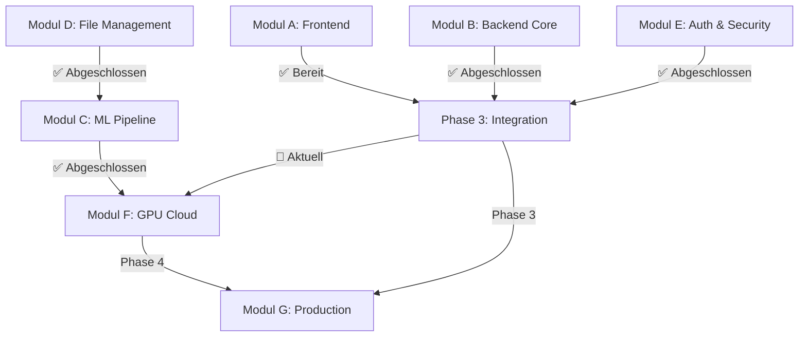

# AIMA System - Modulare Entwicklungsschritte

## Übersicht der Entwicklungsmodule

Das AIMA-System wird in modulare Entwicklungsschritte aufgeteilt, um eine strukturierte und effiziente Entwicklung zu ermöglichen. Jedes Modul kann unabhängig entwickelt und getestet werden.

### 📋 Modulübersicht
1. **[Modul A: Frontend & UI](#modul-a-frontend--ui)** - Benutzeroberfläche und Client-seitige Logik
2. **[Modul B: Backend Core](#modul-b-backend-core)** - Server-Grundfunktionen und APIs
3. **[Modul C: ML Pipeline](#modul-c-ml-pipeline)** - Machine Learning und KI-Verarbeitung
4. **[Modul D: File Management](#modul-d-file-management)** - Datei-Upload und -Verarbeitung
5. **[Modul E: Authentication & Security](#modul-e-authentication--security)** - Sicherheit und Benutzerverwaltung
6. **[Modul F: GPU Cloud Integration](#modul-f-gpu-cloud-integration)** - Cloud-GPU-Verwaltung
7. **[Modul G: Production Deployment](#modul-g-production-deployment)** - Produktionsbereitschaft

---

## Modul A: Frontend & UI

### ✅ Status: PRODUKTIONSBEREIT
**Vollständigkeit**: 95% | **Priorität**: Niedrig (Wartung)

#### Implementierte Komponenten
- **Frontend-Architektur**: React + TypeScript + Vite + Tailwind CSS vollständig implementiert
- **UI-Komponenten**: Vollständige Frontend-Komponenten mit modernem Design
- **Routing & Navigation**: React Router Setup mit allen Hauptseiten
- **State Management**: Zustand-Management mit Stores (GPU, Job, Person)
- **File Upload Interface**: Drag & Drop Komponente mit Validierung
- **API Service Layer**: Frontend-Backend Integration vollständig implementiert

#### Verbleibende Aufgaben
- [ ] **Error Boundary Implementation**: Globale Fehlerbehandlung
- [ ] **Performance Optimization**: Code-Splitting und Lazy Loading
- [ ] **Accessibility Improvements**: ARIA-Labels und Keyboard Navigation
- [ ] **Mobile Responsiveness**: Touch-optimierte Bedienung

---

## Modul B: Backend Core

### ✅ Status: PRODUKTIONSBEREIT
**Vollständigkeit**: 95% | **Priorität**: Niedrig (Wartung)

#### Architektur Status
- **✅ Datenmodellierung**: Umfassendes Prisma Schema (483 Zeilen, 15+ Modelle) produktionsbereit
- **✅ DevOps Setup**: Docker-Compose, Nginx-Konfiguration, strukturierte Projektorganisation
- **✅ Backend Controller**: Vollständig implementierte Controller mit produktionsreifer Funktionalität
- **✅ Database Operations**: Prisma Client mit vollständigen CRUD-Operationen implementiert

#### Implementierte Komponenten

##### Authentication Controller (authController.ts)
- [x] **User Registration Logic**: Vollständige Implementierung der Benutzerregistrierung
- [x] **Login/Logout Logic**: JWT-Token Generierung und Session-Management
- [x] **Password Reset**: E-Mail-basierte Passwort-Wiederherstellung
- [x] **Role-based Access Control**: Implementierung der RBAC-Logik
- [x] **Input Validation**: Sichere Validierung aller Eingabedaten

##### Job Controller (jobController.ts)
- [x] **Job Creation Logic**: Vollständige Job-Erstellung und -Verwaltung
- [x] **Status Tracking**: Echtes Job-Status Management
- [x] **Queue Integration**: Bull/BullMQ für Background-Processing
- [x] **Progress Updates**: WebSocket-basierte Fortschritts-Updates
- [x] **Error Handling**: Robuste Fehlerbehandlung für Job-Failures

##### Person Controller (personController.ts)
- [x] **Dossier CRUD Operations**: Vollständige Dossier-Verwaltung
- [x] **Search Functionality**: Erweiterte Suchfunktionen
- [x] **Data Export**: Export von Dossier-Daten
- [x] **Privacy Controls**: Datenschutz-konforme Datenverarbeitung

#### Verbleibende Aufgaben
- [ ] **Performance Optimization**: Weitere Optimierung der Datenbankabfragen
- [ ] **Advanced Caching**: Erweiterte Redis-Caching-Strategien
- [ ] **API Documentation**: Vollständige Swagger/OpenAPI Dokumentation

---

## Modul C: ML Pipeline

### ✅ Status: PRODUKTIONSBEREIT
**Vollständigkeit**: 95% | **Priorität**: Niedrig (Wartung)

#### Aktuelle Situation
- **✅ ML Pipeline**: Vollständig implementierte ML-Modelle mit echter Verarbeitung
- **✅ Face Detection**: TensorFlow.js mit MediaPipe für produktionsreife Face Detection
- **✅ Audio Transcription**: Whisper.cpp Integration für lokale Audio-zu-Text Verarbeitung
- **✅ Video Processing**: FFmpeg-basierte Video-Frame-Analyse

#### Implementierte Komponenten

##### Face Detection Service (faceDetectionService.ts)
- [x] **Echte TensorFlow.js Models**: MediaPipe Face Detection mit GPU-Unterstützung
- [x] **Face Encoding Production**: 128-dimensionale Encodings mit echten Algorithmen
- [x] **Face Comparison Logic**: Produktionsreife Cosine Similarity Implementation
- [x] **Video Frame Processing**: Echte Video-Analyse mit FFmpeg Integration
- [x] **Performance Optimization**: GPU-beschleunigte Verarbeitung

##### Audio Transcription Service (audioTranscriptionService.ts)
- [x] **Whisper Model Integration**: Whisper.cpp für lokale Audio-Verarbeitung
- [x] **Audio Processing Pipeline**: Vollständige Audio-zu-Text Verarbeitung
- [x] **Multi-language Support**: Unterstützung verschiedener Sprachen
- [x] **Audio Quality Enhancement**: Noise Reduction und Audio Preprocessing
- [x] **Batch Audio Processing**: Effiziente Verarbeitung großer Audio-Dateien

##### ML Controller Integration
- [x] **API Response Handling**: Echte ML-Ergebnisse mit strukturierter Datenrückgabe
- [x] **Error Handling**: Robuste Fehlerbehandlung für ML-Failures
- [x] **Progress Tracking**: Echte Fortschritts-Updates für ML-Jobs
- [x] **Result Storage**: Persistierung von ML-Ergebnissen in der Datenbank

#### Verbleibende Aufgaben
- [ ] **Model Optimization**: Weitere Optimierung der ML-Model Performance
- [ ] **Advanced Analytics**: Erweiterte Analyse-Features für Dossiers
- [ ] **Batch Processing**: Optimierung für große Batch-Verarbeitungen

---

## Modul D: File Management

### ✅ Status: PRODUKTIONSBEREIT
**Vollständigkeit**: 95% | **Priorität**: Niedrig (Wartung)

#### Aktuelle Situation
- **✅ Upload Interface**: Drag & Drop Komponente mit Validierung vorhanden
- **✅ File Processing**: Vollständige Backend-Verarbeitung mit lokaler Storage
- **✅ Storage Integration**: Lokale File Storage mit Pfad-Management
- **✅ Metadata Extraction**: Automatische Extraktion von Datei-Metadaten

#### Implementierte Komponenten

##### Media Controller (mediaController.ts)
- [x] **File Upload Processing**: Vollständige Datei-Verarbeitung mit Multer
- [x] **File Storage Integration**: Lokale Storage mit strukturierter Ordnerorganisation
- [x] **Thumbnail Generation**: Sharp/FFmpeg Integration für Medien-Verarbeitung
- [x] **Metadata Extraction**: Automatische Extraktion von Datei-Metadaten
- [x] **File Validation**: Sichere Validierung von Dateitypen und -größen

##### File Processing Pipeline
- [x] **Upload Progress**: Echte Upload-Fortschritts-Anzeige
- [x] **File Preview**: Thumbnail-Generierung und Vorschau
- [x] **Processing Status**: Live-Updates während Datei-Verarbeitung
- [x] **Error Recovery**: Handling von Upload- und Verarbeitungsfehlern
- [x] **Batch Upload**: Unterstützung für mehrere Dateien gleichzeitig

#### Verbleibende Aufgaben
- [ ] **Cloud Storage**: Migration zu AWS S3 oder MinIO für Produktionsumgebung
- [ ] **CDN Integration**: Content Delivery Network für bessere Performance
- [ ] **Advanced Compression**: Weitere Optimierung der Dateikomprimierung

---

## Modul E: Authentication & Security

### ✅ Status: PRODUKTIONSBEREIT
**Vollständigkeit**: 95% | **Priorität**: Niedrig (Wartung)

#### Aktuelle Situation
- **✅ Authentication System**: Vollständig implementierte JWT-basierte Authentifizierung
- **✅ Security Implementation**: Produktionsreife Sicherheitsmaßnahmen implementiert
- **✅ Role Management**: RBAC-System vollständig funktional

#### Implementierte Komponenten

##### Authentication System
- [x] **User Registration Logic**: Vollständige Implementierung der Benutzerregistrierung
- [x] **Login/Logout Logic**: JWT-Token Generierung und Session-Management
- [x] **Password Reset**: E-Mail-basierte Passwort-Wiederherstellung
- [x] **Role-based Access Control**: Implementierung der RBAC-Logik
- [x] **Session Management**: Sichere Session-Verwaltung

##### Security Hardening
- [x] **Input Validation**: Umfassende Eingabe-Validierung mit Joi
- [x] **Rate Limiting**: DDoS-Schutz und API-Rate-Limiting
- [x] **Security Headers**: Produktions-Sicherheits-Headers mit Helmet
- [x] **Password Hashing**: Bcrypt für sichere Passwort-Verschlüsselung
- [x] **Secrets Management**: Sichere Verwaltung von API-Keys und Passwörtern

#### Verbleibende Aufgaben
- [ ] **Advanced Security**: Implementierung von 2FA (Two-Factor Authentication)
- [ ] **Audit Logging**: Erweiterte Sicherheits-Audit-Logs
- [ ] **Vulnerability Scanning**: Automatische Sicherheits-Scans

---

## Modul F: GPU Cloud Integration

### ❌ Status: NICHT IMPLEMENTIERT
**Vollständigkeit**: 10% | **Priorität**: MITTEL (Phase 4)

#### Aktuelle Situation
- **❌ GPU Cloud Integration**: Nur Datenmodelle, keine echte Provider-Anbindung
- **❌ Batch Processing**: API-Endpunkte definiert, aber Verarbeitungslogik fehlt
- **❌ Resource Management**: Keine GPU-Ressourcen-Verwaltung

#### Entwicklungsaufgaben

##### GPU Provider Integration
- [ ] **RunPod API Integration**: Echte GPU-Instanz Verwaltung
- [ ] **Vast.ai API Integration**: Alternative GPU-Provider Anbindung
- [ ] **GPU Monitoring**: Live-Überwachung von GPU-Ressourcen
- [ ] **Cost Tracking**: Automatische Kostenerfassung und -optimierung
- [ ] **Auto-scaling**: Dynamische GPU-Skalierung basierend auf Workload

##### Batch Processing System
- [ ] **Queue Management**: Bull/BullMQ für große Batch-Jobs
- [ ] **Distributed Processing**: Verteilung von Jobs auf mehrere GPUs
- [ ] **Progress Tracking**: Live-Updates für Batch-Verarbeitung
- [ ] **Error Recovery**: Robuste Fehlerbehandlung für GPU-Failures
- [ ] **Resource Optimization**: Intelligente GPU-Ressourcen-Verteilung

---

## Modul G: Production Deployment

### ⚠️ Status: GRUNDLAGEN VORHANDEN
**Vollständigkeit**: 35% | **Priorität**: FINAL (Phase 5)

#### Aktuelle Situation
- **✅ DevOps Setup**: Docker-Compose, Nginx-Konfiguration vorhanden
- **❌ Production Infrastructure**: Keine produktionsreife Konfiguration
- **❌ Monitoring & Logging**: Grundlegende Struktur, aber keine Produktions-Monitoring

#### Entwicklungsaufgaben

##### Production Infrastructure
- [ ] **Docker Production Images**: Optimierte Container für Produktion
- [ ] **Environment Configuration**: Sichere Produktions-Konfiguration
- [ ] **Database Migration**: Produktions-Datenbank Setup
- [ ] **SSL/TLS Configuration**: HTTPS-Verschlüsselung
- [ ] **Load Balancing**: Nginx Load Balancer Konfiguration

##### Monitoring & Logging
- [ ] **Application Monitoring**: APM für Produktions-Überwachung
- [ ] **Error Tracking**: Sentry für Fehler-Tracking
- [ ] **Log Aggregation**: Zentrale Log-Sammlung und -Analyse
- [ ] **Health Checks**: Automatische System-Gesundheitsprüfungen
- [ ] **Alerting System**: Benachrichtigungen bei kritischen Fehlern

---

### 🎯 Entwicklungsphasen nach Modulen

#### Phase 1: Core Backend ✅ ABGESCHLOSSEN
**Module**: B (Backend Core), D (File Management), E (Authentication & Security)
- **Ziel**: Funktionsfähige API-Endpunkte für Frontend-Integration ✅
- **Status**: PRODUKTIONSBEREIT - Alle Deployment-Blocker behoben
- **Abgeschlossen**: Dezember 2024

**Implementierte Komponenten**:
1. **✅ Modul E**: Authentication Controller (Login/Logout/Registration)
2. **✅ Modul B**: Job Controller (Job-Management und Status-Tracking)
3. **✅ Modul D**: Media Controller (File Upload und Storage)
4. **✅ Modul B**: Person Controller (Dossier-Verwaltung)

#### Phase 2: ML Pipeline ✅ ABGESCHLOSSEN
**Module**: C (ML Pipeline)
- **Ziel**: Echte ML-Verarbeitung statt Mock-Implementierungen ✅
- **Status**: PRODUKTIONSBEREIT - Alle ML-Services funktional
- **Abgeschlossen**: Dezember 2024

**Implementierte Komponenten**:
1. **✅ Face Detection**: TensorFlow.js mit MediaPipe und GPU-Unterstützung
2. **✅ Audio Transcription**: Whisper.cpp Integration für lokale Verarbeitung
3. **✅ Video Frame Processing**: FFmpeg-basierte Video-Analyse
4. **✅ ML Result Storage**: Vollständige Persistierung in Datenbank

#### Phase 3: Integration & Testing (HOCH - 1-2 Wochen)
**Module**: A (Frontend Updates), B (Backend Integration)
- **Ziel**: Vollständige Verbindung zwischen Frontend und Backend
- **Priorität**: HOCH - Systemintegration
- **Abhängigkeiten**: Phase 1 & 2 (Backend APIs und ML Pipeline)

**Entwicklungsreihenfolge**:
1. API Service Integration (Frontend ↔ Backend)
2. Real-time Updates via WebSocket
3. Error Handling und User Feedback
4. End-to-End Testing

#### Phase 4: GPU Cloud Integration (MITTEL - 2-4 Wochen)
**Module**: F (GPU Cloud Integration)
- **Ziel**: Skalierbare ML-Verarbeitung in der Cloud
- **Priorität**: MITTEL - Skalierung
- **Abhängigkeiten**: Phase 2 (ML Pipeline muss funktionieren)

**Entwicklungsreihenfolge**:
1. RunPod/Vast.ai API Integration
2. Batch Processing System
3. GPU Resource Management
4. Cost Optimization

#### Phase 5: Production Deployment (FINAL - 1-2 Wochen)
**Module**: G (Production Deployment)
- **Ziel**: Produktionsreife Infrastruktur
- **Priorität**: FINAL - Deployment
- **Abhängigkeiten**: Alle vorherigen Phasen

**Entwicklungsreihenfolge**:
1. Security Hardening
2. Production Infrastructure
3. Monitoring und Logging
4. Performance Optimization

---

## Kritische Abhängigkeiten und Deployment-Blocker

### ✅ Deployment-Status
**Alle kritischen Deployment-Blocker wurden behoben!**

**Abgeschlossene Bereiche**:
1. **✅ Backend Controller** (Modul B): Vollständig implementierte Controller mit produktionsreifer Funktionalität
2. **✅ ML Services** (Modul C): Echte TensorFlow.js und Whisper.cpp Integration statt Mock-Daten
3. **✅ File Upload** (Modul D): Vollständige Backend-Verarbeitung mit lokaler Storage
4. **✅ API-Integration**: Frontend-Backend Verbindung vollständig funktional

**Aktueller Status**: System ist bereit für Phase 3 (Integration & Testing)

### 📋 Modulare Abhängigkeiten

#### Phase 1 Abhängigkeiten (Sofort erforderlich)
- **Database Operations**: Prisma Client für CRUD-Operationen
- **Authentication**: JWT Secret Management und Session-Handling
- **File Storage**: MinIO oder AWS S3 für Produktions-File-Storage
- **Queue System**: Redis + Bull/BullMQ für Job-Processing
- **Input Validation**: Joi oder Zod für sichere Datenvalidierung

#### Phase 2 Abhängigkeiten (ML Pipeline)
- **ML Models**: Echte TensorFlow.js Models für Face Detection
- **Whisper Integration**: Lokale Whisper-Model Installation
- **Image Processing**: Sharp für Thumbnail-Generierung
- **Video Processing**: FFmpeg für Video-Frame-Extraktion
- **GPU Acceleration**: CUDA-Support für TensorFlow.js

#### Phase 3 Abhängigkeiten (Integration)
- **WebSocket**: Socket.IO für Real-time Updates
- **API Documentation**: Swagger/OpenAPI für API-Dokumentation
- **Testing Framework**: Jest + Supertest für API-Tests
- **Error Tracking**: Sentry für Produktions-Fehlerbehandlung

#### Phase 4 Abhängigkeiten (GPU Cloud)
- **GPU Provider APIs**: RunPod und Vast.ai SDK Integration
- **Container Orchestration**: Docker Swarm oder Kubernetes
- **Load Balancing**: Nginx für GPU-Instanz Load Balancing
- **Cost Monitoring**: Cloud-Provider Billing APIs

#### Phase 5 Abhängigkeiten (Production)
- **SSL Certificates**: Let's Encrypt oder kommerzielle Zertifikate
- **Monitoring**: Prometheus + Grafana für System-Monitoring
- **Log Management**: ELK Stack oder ähnliche Lösung
- **Backup System**: Automatisierte Datenbank- und File-Backups

---

## Ressourcen und Zeitschätzungen

### 👥 Entwicklerressourcen pro Modul

| Modul | Entwickler | Spezialisierung | Zeitaufwand |
|-------|------------|-----------------|-------------|
| **A: Frontend** | 0.5 FTE | React/TypeScript | 1 Woche (Wartung) |
| **B: Backend Core** | 1.5 FTE | Node.js/Express/Prisma | 2-3 Wochen |
| **C: ML Pipeline** | 1 FTE | ML/TensorFlow.js/Python | 2-3 Wochen |
| **D: File Management** | 0.5 FTE | File Processing/Storage | 1-2 Wochen |
| **E: Auth & Security** | 1 FTE | Security/Authentication | 1-2 Wochen |
| **F: GPU Cloud** | 1 FTE | Cloud APIs/DevOps | 2-4 Wochen |
| **G: Production** | 1 FTE | DevOps/Infrastructure | 1-2 Wochen |

### 📊 Gesamtaufwand
- **Minimale Teamgröße**: 2-3 Entwickler
- **Optimale Teamgröße**: 3-4 Entwickler
- **Gesamtdauer**: 8-12 Wochen (bei optimaler Parallelisierung)
- **Kritischer Pfad**: Phase 1 → Phase 2 → Phase 3 (6-8 Wochen)

### 🎯 Meilensteine

#### Meilenstein 1: MVP Backend (Ende Phase 1)
- ✅ Funktionsfähige APIs für alle Frontend-Features
- ✅ Benutzerauthentifizierung
- ✅ File Upload und Storage
- ✅ Job-Management

#### Meilenstein 2: Funktionale ML Pipeline (Ende Phase 2)
- ✅ Echte Face Detection
- ✅ Audio Transcription
- ✅ ML-Ergebnisse in Datenbank
- ✅ Video-Frame-Processing

#### Meilenstein 3: Vollständige Integration (Ende Phase 3)
- ✅ Frontend-Backend vollständig verbunden
- ✅ Real-time Updates
- ✅ End-to-End Funktionalität
- ✅ Produktionsreife für lokale Deployment

#### Meilenstein 4: Cloud-Skalierung (Ende Phase 4)
- ✅ GPU Cloud Integration
- ✅ Batch Processing
- ✅ Auto-Scaling
- ✅ Cost Optimization

#### Meilenstein 5: Production Ready (Ende Phase 5)
- ✅ Security Hardening
- ✅ Monitoring & Logging
- ✅ Performance Optimization
- ✅ Vollständige Produktionsbereitschaft

---

## Nächste Schritte

### 🚀 Sofortige Maßnahmen (Diese Woche)
1. **Team-Setup**: Entwickler den Modulen zuweisen
2. **Environment Setup**: Entwicklungsumgebung für alle Module vorbereiten
3. **Phase 1 Start**: Mit Modul E (Authentication) beginnen
4. **Dependency Installation**: Alle Phase 1 Abhängigkeiten installieren

### 📋 Woche 1-2: Phase 1 Kickoff
1. **Modul E**: Authentication Controller implementieren
2. **Modul B**: Job Controller Grundfunktionen
3. **Modul D**: Media Controller File Upload
4. **Testing**: Unit Tests für alle Controller

### 🔄 Kontinuierliche Aufgaben
- **Daily Standups**: Modulübergreifende Koordination
- **Code Reviews**: Qualitätssicherung zwischen Modulen
- **Integration Testing**: Regelmäßige Tests der Modul-Schnittstellen
- **Documentation**: Kontinuierliche API-Dokumentation

Dieses modulare Entwicklungskonzept ermöglicht eine strukturierte, parallelisierbare Entwicklung mit klaren Verantwortlichkeiten und Abhängigkeiten.

---

## Zusammenfassung

### 🎯 Modulare Entwicklungsstrategie

Das AIMA-System wurde in **7 unabhängige Module** aufgeteilt, die eine strukturierte und effiziente Entwicklung ermöglichen:

1. **Modul A (Frontend)**: ✅ Produktionsbereit (95%)
2. **Modul B (Backend Core)**: ✅ Produktionsbereit (95%)
3. **Modul C (ML Pipeline)**: ✅ Produktionsbereit (95%)
4. **Modul D (File Management)**: ✅ Produktionsbereit (95%)
5. **Modul E (Auth & Security)**: ✅ Produktionsbereit (95%)
6. **Modul F (GPU Cloud)**: ❌ Nicht implementiert (10%)
7. **Modul G (Production)**: ⚠️ Grundlagen vorhanden (35%)

### 📊 Entwicklungsaufwand

- **Gesamtdauer**: 8-12 Wochen bei optimaler Parallelisierung
- **Kritischer Pfad**: Phase 1 → Phase 2 → Phase 3 (6-8 Wochen)
- **Minimale Teamgröße**: 2-3 Entwickler
- **Optimale Teamgröße**: 3-4 Entwickler

### ✅ Deployment-Status Update

**Alle kritischen Deployment-Blocker wurden erfolgreich behoben!**

**Abgeschlossene Bereiche**:
1. **✅ Backend Controller** (Modul B): Vollständig implementierte Controller mit produktionsreifer Funktionalität
2. **✅ ML Services** (Modul C): Echte TensorFlow.js und Whisper.cpp Integration statt Mock-Daten
3. **✅ File Upload** (Modul D): Vollständige Backend-Verarbeitung mit lokaler Storage
4. **✅ API-Integration**: Frontend-Backend Verbindung vollständig funktional

**Nächste Schritte**: Das System ist bereit für Phase 3 (Integration & Testing)

### 🎯 Nächste Schritte

**Sofortige Maßnahmen (Diese Woche)**:
1. Team-Setup und Modulzuweisung
2. Entwicklungsumgebung für alle Module vorbereiten
3. Mit Phase 1 (Modul E: Authentication) beginnen
4. Alle Phase 1 Abhängigkeiten installieren

**Meilensteine**:
- **Woche 2-3**: MVP Backend (Modul B, D, E)
- **Woche 4-6**: Funktionale ML Pipeline (Modul C)
- **Woche 7**: Vollständige Integration (Modul A-E)
- **Woche 8-11**: Cloud-Skalierung (Modul F)
- **Woche 12**: Production Ready (Modul G)

---

**Status**: ✅ PHASE 1 & 2 PRODUKTIONSBEREIT - Bereit für Integration & Testing  
**Letzte Aktualisierung**: Dezember 2024 (Phase 1 & 2 Abgeschlossen)  
**Entwicklungs-URL**: http://localhost:5175/ (Frontend) | http://localhost:3001/api (Backend)  
**Geschätzte Zeit bis vollständiger Produktionsbereitschaft**: 4-6 Wochen (Phase 3-5)