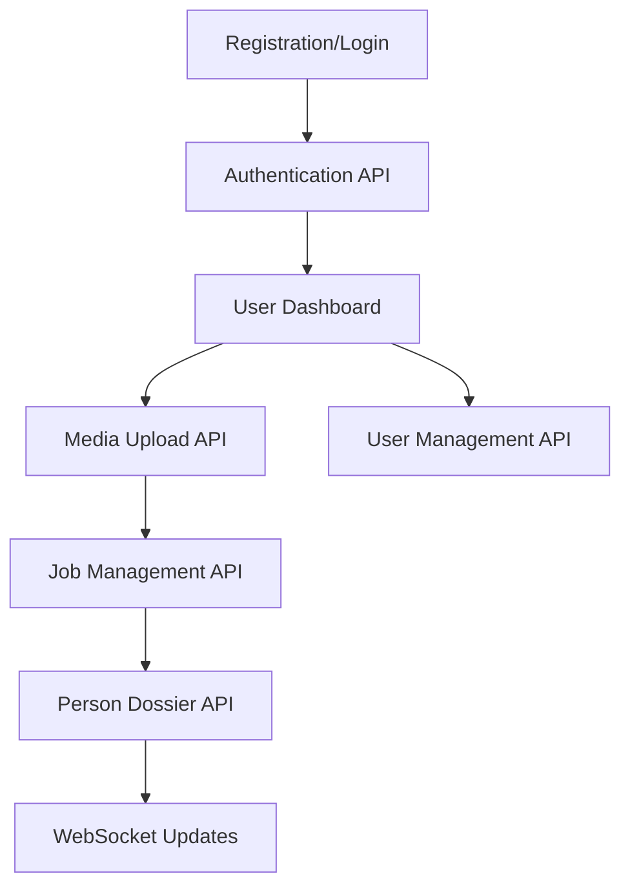

# AIMA System - Phase 1 Backend Requirements

## 1. Produktübersicht

Phase 1 des AIMA-Systems fokussiert sich auf die Implementierung der kritischen Backend-Infrastruktur, die als Grundlage für alle weiteren Entwicklungsphasen dient. Diese Phase umfasst Backend Core APIs, Authentifizierung & Sicherheit sowie File Management.

Das Ziel ist die Bereitstellung funktionsfähiger API-Endpunkte, die eine vollständige Integration mit dem bereits vorhandenen Frontend ermöglichen und die Basis für ML-Pipeline-Integration in Phase 2 schaffen.

## 2. Kernfunktionen

### 2.1 Benutzerrollen

| Rolle | Registrierungsmethode | Kernberechtigungen |
|-------|----------------------|--------------------|
| Standard User | E-Mail-Registrierung | Kann Medien hochladen, Jobs erstellen, eigene Dossiers verwalten |
| Admin User | System-Einladung | Vollzugriff auf alle Funktionen, Benutzerverwaltung, System-Konfiguration |

### 2.2 Feature Module

Unsere Phase 1 Backend-Anforderungen bestehen aus den folgenden Hauptseiten:

1. **Authentication API**: Benutzerregistrierung, Login/Logout, Session-Management
2. **Job Management API**: Job-Erstellung, Status-Tracking, Queue-Integration
3. **Media Upload API**: File-Upload, Storage-Integration, Metadaten-Extraktion
4. **Person Dossier API**: Dossier-CRUD-Operationen, Suchfunktionalität
5. **User Management API**: Benutzerprofil-Verwaltung, Rollen-Management

### 2.3 Page Details

| API Endpoint | Modul Name | Feature Beschreibung |
|--------------|------------|----------------------|
| Authentication API | User Registration | Vollständige Benutzerregistrierung mit E-Mail-Validierung, Passwort-Hashing (bcrypt), Input-Validierung |
| Authentication API | Login/Logout | JWT-Token-Generierung, Session-Management, Refresh-Token-Handling, sichere Logout-Funktionalität |
| Authentication API | Password Reset | E-Mail-basierte Passwort-Wiederherstellung mit sicheren Reset-Tokens, Zeitbegrenzung |
| Authentication API | Role-based Access | RBAC-Implementierung mit Middleware, Rollen-Validierung für API-Endpunkte |
| Job Management API | Job Creation | Vollständige Job-Erstellung mit Validierung, Datenbank-Persistierung, Status-Initialisierung |
| Job Management API | Status Tracking | Echtes Job-Status-Management mit Datenbank-Updates, Progress-Tracking |
| Job Management API | Queue Integration | Bull/BullMQ-Integration für Background-Processing, Job-Retry-Logic |
| Job Management API | Progress Updates | WebSocket-basierte Live-Updates für Job-Fortschritt |
| Media Upload API | File Upload Processing | Multipart-Upload-Handling, File-Validierung, temporäre Storage |
| Media Upload API | Storage Integration | MinIO-Integration für File-Storage, Bucket-Management |
| Media Upload API | Metadata Extraction | Automatische Extraktion von Datei-Metadaten (EXIF, Video-Info) |
| Media Upload API | Thumbnail Generation | Sharp/FFmpeg-Integration für Thumbnail-Erstellung |
| Person Dossier API | Dossier CRUD | Vollständige Create, Read, Update, Delete-Operationen für Personen-Dossiers |
| Person Dossier API | Search Functionality | Erweiterte Suchfunktionen mit Filtern, Pagination |
| Person Dossier API | Data Export | Export von Dossier-Daten in verschiedenen Formaten (JSON, CSV) |
| User Management API | Profile Management | Benutzerprofil-Verwaltung, Einstellungen, Präferenzen |
| User Management API | Admin Functions | Admin-spezifische Funktionen für Benutzerverwaltung |

## 3. Core Process

### Standard User Flow
1. Benutzer registriert sich über E-Mail
2. E-Mail-Bestätigung und Account-Aktivierung
3. Login mit JWT-Token-Erhalt
4. Upload von Medien-Dateien über File-Upload-API
5. Erstellung von Analyse-Jobs
6. Überwachung des Job-Status über WebSocket-Updates
7. Verwaltung von Personen-Dossiers

### Admin User Flow
1. Admin-Login mit erweiterten Berechtigungen
2. Benutzerverwaltung und Rollen-Zuweisung
3. System-Überwachung und Job-Management
4. Datenbank-Wartung und Export-Funktionen

## 4. User Interface Design

### 4.1 Design Style
- **Primärfarben**: #2563eb (Blau), #1f2937 (Dunkelgrau)
- **Sekundärfarben**: #10b981 (Grün für Erfolg), #ef4444 (Rot für Fehler)
- **Button-Stil**: Moderne, abgerundete Buttons mit Hover-Effekten
- **Schriftart**: Inter, 14px Standard, 16px für Überschriften
- **Layout-Stil**: Card-basiertes Design mit Top-Navigation
- **Icons**: Heroicons für konsistente Darstellung

### 4.2 API Response Design

| API Endpoint | Response Format | UI Integration |
|--------------|-----------------|----------------|
| Authentication API | JSON mit JWT-Token | Automatische Token-Speicherung, Redirect zu Dashboard |
| Job Management API | JSON mit Job-Status | Live-Updates in Job-Status-Komponenten |
| Media Upload API | JSON mit Upload-Progress | Progress-Bar-Updates, Thumbnail-Anzeige |
| Person Dossier API | JSON mit Dossier-Daten | Card-basierte Dossier-Darstellung |

### 4.3 Responsiveness

Das Backend ist API-first konzipiert und unterstützt sowohl Desktop- als auch Mobile-Clients durch konsistente REST-API-Endpunkte.

## 5. Technische Spezifikationen

### 5.1 Backend-Architektur
- **Framework**: Node.js mit Express.js
- **Datenbank**: PostgreSQL mit Prisma ORM
- **Authentifizierung**: JWT mit bcrypt für Passwort-Hashing
- **File Storage**: MinIO für lokale Entwicklung, S3-kompatibel
- **Queue System**: Bull/BullMQ mit Redis
- **WebSocket**: Socket.IO für Real-time Updates

### 5.2 Sicherheitsanforderungen
- **Input Validation**: Joi/Zod für alle API-Eingaben
- **Rate Limiting**: Express-rate-limit für DDoS-Schutz
- **CORS**: Konfigurierte CORS-Policy für Frontend-Integration
- **Security Headers**: Helmet.js für Sicherheits-Headers
- **Environment Variables**: Sichere Verwaltung von Secrets

### 5.3 API-Dokumentation
- **OpenAPI/Swagger**: Automatische API-Dokumentation
- **Postman Collection**: Vorgefertigte API-Tests
- **Error Handling**: Konsistente Error-Response-Formate

## 6. Implementierungsplan

### Woche 1: Authentication & Security (Modul E)
- [ ] User Registration Controller implementieren
- [ ] Login/Logout Logic mit JWT
- [ ] Password Reset Funktionalität
- [ ] RBAC Middleware implementieren
- [ ] Input Validation Setup

### Woche 2: Job Management (Modul B)
- [ ] Job Controller CRUD-Operationen
- [ ] Bull/BullMQ Queue-Integration
- [ ] WebSocket für Live-Updates
- [ ] Job Status Management
- [ ] Error Handling für Jobs

### Woche 3: File Management (Modul D)
- [ ] Media Controller für File-Upload
- [ ] MinIO Storage-Integration
- [ ] Metadata Extraction
- [ ] Thumbnail Generation
- [ ] File Validation und Security

### Woche 4: Person Dossier & Integration (Modul B)
- [ ] Person Controller CRUD
- [ ] Search und Filter-Funktionalität
- [ ] Data Export Features
- [ ] API-Integration Tests
- [ ] Frontend-Backend Integration

## 7. Akzeptanzkriterien

### Authentication API
- ✅ Benutzer kann sich registrieren und erhält Bestätigungs-E-Mail
- ✅ Login generiert gültigen JWT-Token
- ✅ Password Reset funktioniert mit E-Mail-Link
- ✅ RBAC verhindert unbefugten Zugriff

### Job Management API
- ✅ Jobs können erstellt und in Datenbank gespeichert werden
- ✅ Job-Status wird korrekt getrackt und aktualisiert
- ✅ WebSocket sendet Live-Updates an Frontend
- ✅ Queue-System verarbeitet Jobs im Hintergrund

### Media Upload API
- ✅ Dateien können hochgeladen und gespeichert werden
- ✅ Metadaten werden automatisch extrahiert
- ✅ Thumbnails werden generiert
- ✅ File-Validierung verhindert schädliche Uploads

### Person Dossier API
- ✅ Dossiers können erstellt, gelesen, aktualisiert und gelöscht werden
- ✅ Suchfunktion findet relevante Dossiers
- ✅ Daten können in verschiedenen Formaten exportiert werden

## 8. Deployment-Vorbereitung

### Entwicklungsumgebung
- Docker-Compose Setup für lokale Entwicklung
- PostgreSQL-Datenbank mit Prisma-Migrationen
- Redis für Queue-System
- MinIO für File-Storage

### Testing
- Unit Tests für alle Controller
- Integration Tests für API-Endpunkte
- Load Testing für Performance-Validierung

### Monitoring
- Logging mit Winston
- Health Check Endpunkte
- Performance Monitoring

---

**Status**: 🚧 IN ENTWICKLUNG - Phase 1 Backend Implementation  
**Priorität**: KRITISCH - Deployment-Blocker  
**Geschätzte Fertigstellung**: 4 Wochen  
**Abhängigkeiten**: Prisma Schema (✅ vorhanden), Frontend (✅ bereit für Integration)