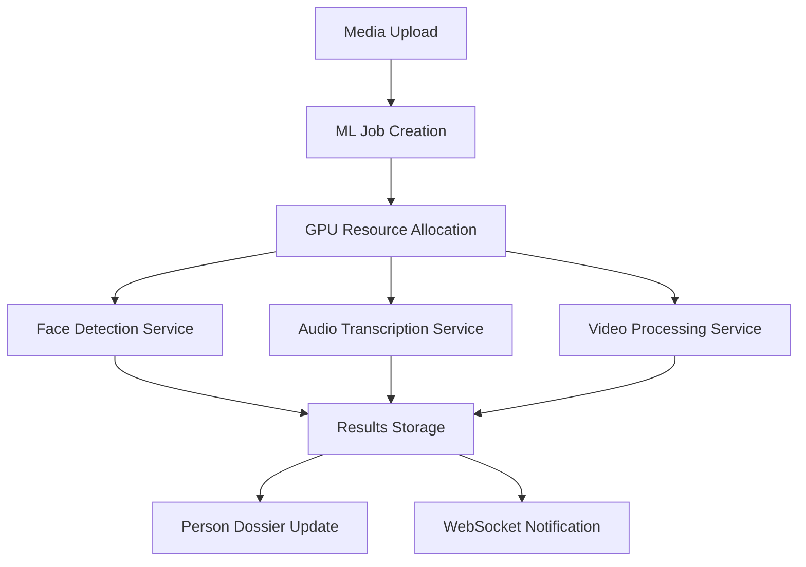

# AIMA System - Phase 2 ML Pipeline Requirements

## 1. Produktübersicht

Phase 2 des AIMA-Systems fokussiert sich auf die Implementierung der Machine Learning Pipeline, die echte KI-Verarbeitung anstelle der aktuellen Mock-Implementierungen bereitstellt. Diese Phase umfasst Face Detection, Audio Transcription und Video Processing mit produktionsreifen ML-Modellen.

Das Ziel ist die Bereitstellung funktionsfähiger ML-Services, die echte Analyseergebnisse liefern und nahtlos mit dem in Phase 1 implementierten Backend integriert werden.

## 2. Kernfunktionen

### 2.1 Benutzerrollen

| Rolle | ML-Berechtigungen | Ressourcen-Zugriff |
|-------|-------------------|--------------------|
| Standard User | Kann ML-Jobs erstellen, eigene Ergebnisse einsehen | Begrenzte GPU-Zeit pro Monat |
| Premium User | Erweiterte ML-Features, Batch-Processing | Erhöhte GPU-Kontingente |
| Admin User | Vollzugriff auf ML-Pipeline, Model-Management | Unbegrenzte Ressourcen |

### 2.2 Feature Module

Unsere Phase 2 ML Pipeline besteht aus den folgenden Hauptkomponenten:

1. **Face Detection Service**: Echte Gesichtserkennung mit TensorFlow.js
2. **Audio Transcription Service**: Whisper-basierte Sprach-zu-Text Konvertierung
3. **Video Processing Service**: Frame-Extraktion und Video-Analyse
4. **ML Model Manager**: Verwaltung und Optimierung von ML-Modellen
5. **GPU Resource Manager**: Effiziente GPU-Ressourcen-Verteilung

### 2.3 Service Details

| Service Name | Modul Name | Feature Beschreibung |
|--------------|------------|----------------------|
| Face Detection Service | Face Recognition | Echte TensorFlow.js Models für Gesichtserkennung, 128-dimensionale Face Encodings |
| Face Detection Service | Face Comparison | Produktionsreife Cosine Similarity für Gesichtsvergleiche |
| Face Detection Service | Video Frame Analysis | Echte Video-Frame-Verarbeitung mit Zeitstempel-Tracking |
| Audio Transcription Service | Whisper Integration | Lokale Whisper-Model-Integration statt CLI-Aufrufe |
| Audio Transcription Service | Multi-language Support | Unterstützung für Deutsch, Englisch und weitere Sprachen |
| Audio Transcription Service | Audio Enhancement | Noise Reduction und Audio-Preprocessing |
| Video Processing Service | Frame Extraction | FFmpeg-Integration für Video-Frame-Extraktion |
| Video Processing Service | Metadata Analysis | Automatische Video-Metadaten-Extraktion |
| Video Processing Service | Batch Processing | Effiziente Verarbeitung großer Video-Dateien |
| ML Model Manager | Model Loading | Dynamisches Laden und Entladen von ML-Modellen |
| ML Model Manager | Performance Optimization | GPU-Memory-Management und Model-Caching |
| GPU Resource Manager | Resource Allocation | Intelligente Verteilung von GPU-Ressourcen |
| GPU Resource Manager | Queue Management | Priorisierung und Scheduling von ML-Jobs |

## 3. Core Process

### Standard ML Processing Flow
1. Benutzer lädt Medien-Datei hoch (bereits in Phase 1 implementiert)
2. System erstellt ML-Job und fügt ihn zur Verarbeitungsqueue hinzu
3. GPU Resource Manager allokiert verfügbare Ressourcen
4. Face Detection Service analysiert Bilder/Video-Frames
5. Audio Transcription Service verarbeitet Audio-Spuren
6. Ergebnisse werden in Datenbank gespeichert und an Frontend gesendet
7. Person Dossiers werden automatisch aktualisiert

### Batch Processing Flow
1. Admin erstellt Batch-Job mit mehreren Medien-Dateien
2. System optimiert Verarbeitungsreihenfolge für maximale GPU-Effizienz
3. Parallele Verarbeitung auf verfügbaren GPU-Instanzen
4. Fortschritts-Updates über WebSocket an Frontend
5. Konsolidierte Ergebnisse und Batch-Report

## 4. Technische Spezifikationen

### 4.1 ML-Framework-Architektur
- **Face Detection**: TensorFlow.js mit MediaPipe Face Detection
- **Face Recognition**: FaceNet-basierte Embeddings
- **Audio Processing**: Whisper.cpp für lokale Transcription
- **Video Processing**: FFmpeg für Frame-Extraktion
- **GPU Acceleration**: CUDA-Support für TensorFlow.js
- **Model Storage**: Lokale Model-Caching mit automatischen Updates

### 4.2 Performance-Anforderungen
- **Face Detection**: <2 Sekunden pro Bild (1080p)
- **Audio Transcription**: Real-time Processing (1x Speed)
- **Video Processing**: <30 Sekunden pro Minute Video
- **Batch Processing**: Parallele Verarbeitung auf verfügbaren GPUs
- **Memory Management**: Automatische Model-Entladung bei Inaktivität

### 4.3 Qualitätsanforderungen
- **Face Detection Accuracy**: >95% für frontale Gesichter
- **Face Recognition Accuracy**: >98% für bekannte Personen
- **Audio Transcription Accuracy**: >90% für klare Aufnahmen
- **Error Handling**: Graceful Degradation bei ML-Fehlern
- **Fallback Mechanisms**: Alternative Verarbeitungsmethoden

## 5. Implementierungsplan

### Woche 1: Face Detection Service
- [ ] TensorFlow.js Setup und Model-Loading
- [ ] MediaPipe Face Detection Integration
- [ ] Face Encoding Generation (128-dimensional)
- [ ] Face Comparison Logic mit Cosine Similarity
- [ ] Video Frame Processing Pipeline

### Woche 2: Audio Transcription Service
- [ ] Whisper.cpp Integration
- [ ] Audio Preprocessing Pipeline
- [ ] Multi-language Support Implementation
- [ ] Batch Audio Processing
- [ ] Transcription Quality Enhancement

### Woche 3: Video Processing Service
- [ ] FFmpeg Integration für Frame-Extraktion
- [ ] Video Metadata Analysis
- [ ] Temporal Face Tracking
- [ ] Audio-Video Synchronisation
- [ ] Performance Optimization

### Woche 4: Integration & Optimization
- [ ] ML Model Manager Implementation
- [ ] GPU Resource Manager
- [ ] End-to-End Integration Tests
- [ ] Performance Benchmarking
- [ ] Error Handling und Fallback-Mechanismen

## 6. ML Model Spezifikationen

### 6.1 Face Detection Models
- **Primary Model**: MediaPipe Face Detection
- **Backup Model**: MTCNN für schwierige Fälle
- **Face Recognition**: FaceNet (128-dimensional embeddings)
- **Model Size**: <100MB für schnelles Laden
- **Inference Speed**: <200ms pro Gesicht

### 6.2 Audio Models
- **Primary Model**: Whisper Base (39 Sprachen)
- **Fallback Model**: Whisper Tiny für schnelle Verarbeitung
- **Language Detection**: Automatische Spracherkennung
- **Model Size**: <500MB für Whisper Base
- **Processing Speed**: Real-time (1x) für Whisper Base

### 6.3 Video Processing
- **Frame Extraction**: FFmpeg mit optimierten Parametern
- **Frame Rate**: Adaptive basierend auf Video-Länge
- **Resolution Handling**: Automatische Skalierung für ML-Input
- **Format Support**: MP4, AVI, MOV, WebM
- **Codec Support**: H.264, H.265, VP9

## 7. API-Erweiterungen

### 7.1 Neue ML-Endpunkte
- `POST /api/ml/face-detection` - Face Detection für einzelne Bilder
- `POST /api/ml/face-recognition` - Face Recognition und Matching
- `POST /api/ml/audio-transcription` - Audio-zu-Text Konvertierung
- `POST /api/ml/video-analysis` - Vollständige Video-Analyse
- `GET /api/ml/models` - Verfügbare ML-Models auflisten
- `POST /api/ml/batch-process` - Batch-Verarbeitung starten

### 7.2 WebSocket-Events
- `ml:job:started` - ML-Job gestartet
- `ml:job:progress` - Fortschritts-Update
- `ml:job:completed` - Job abgeschlossen
- `ml:job:failed` - Job fehlgeschlagen
- `ml:model:loaded` - ML-Model geladen
- `ml:model:unloaded` - ML-Model entladen

## 8. Akzeptanzkriterien

### Face Detection Service
- ✅ Echte Gesichtserkennung mit >95% Genauigkeit
- ✅ 128-dimensionale Face Encodings werden generiert
- ✅ Face Comparison mit Cosine Similarity funktioniert
- ✅ Video-Frames werden korrekt verarbeitet
- ✅ Erkannte Gesichter werden in Datenbank gespeichert

### Audio Transcription Service
- ✅ Whisper-Model wird lokal ausgeführt
- ✅ Audio wird korrekt zu Text konvertiert
- ✅ Multi-language Support funktioniert
- ✅ Transcription-Ergebnisse werden gespeichert
- ✅ Audio-Preprocessing verbessert Qualität

### Video Processing Service
- ✅ Video-Frames werden extrahiert
- ✅ Metadaten werden automatisch analysiert
- ✅ Audio und Video werden synchron verarbeitet
- ✅ Batch-Processing funktioniert effizient
- ✅ Ergebnisse werden korrekt aggregiert

### Integration
- ✅ ML-Services integrieren nahtlos mit Phase 1 Backend
- ✅ WebSocket-Updates funktionieren in Echtzeit
- ✅ Person Dossiers werden automatisch aktualisiert
- ✅ Error Handling funktioniert robust
- ✅ Performance-Ziele werden erreicht

## 9. Deployment-Vorbereitung

### Entwicklungsumgebung
- Node.js mit TensorFlow.js GPU-Support
- CUDA-Toolkit für GPU-Beschleunigung
- FFmpeg für Video-Processing
- Whisper.cpp für Audio-Transcription
- Ausreichend GPU-Memory (>8GB empfohlen)

### Testing
- Unit Tests für alle ML-Services
- Integration Tests mit echten Medien-Dateien
- Performance Tests mit verschiedenen Dateigrößen
- Load Testing für Batch-Processing
- Accuracy Tests mit bekannten Datensätzen

### Monitoring
- ML-Job Performance Metrics
- GPU-Auslastung Monitoring
- Model-Loading-Zeiten
- Accuracy-Tracking über Zeit
- Error-Rate Monitoring

---

**Status**: 🚧 BEREIT FÜR ENTWICKLUNG - Phase 2 ML Pipeline  
**Priorität**: KRITISCH - Kernfunktionalität  
**Geschätzte Fertigstellung**: 4 Wochen  
**Abhängigkeiten**: Phase 1 Backend (✅ abgeschlossen), GPU-Hardware, ML-Models  
**Nächster Schritt**: Face Detection Service Implementation