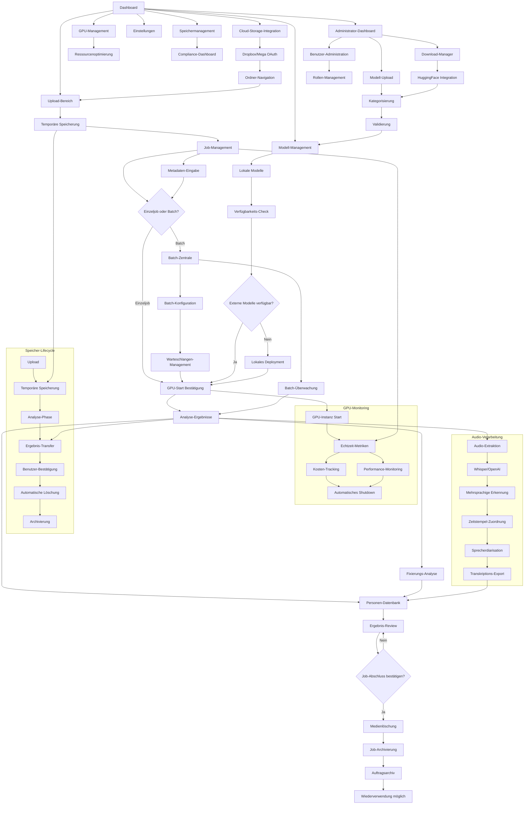

# AIMA (Artificial Intelligence Media Analysis) - Produktanforderungsdokumentation

## 1. Produktübersicht

AIMA (Artificial Intelligence Media Analysis) ist ein **modulares, austauschbares** intelligentes Analysesystem für Videos und Fotos, das Machine Learning und Large Language Models nutzt, um automatisierte Inhaltsanalyse, Objekterkennung und semantische Beschreibungen zu generieren.

Das System löst das Problem der manuellen Medienanalyse für Content-Creator, Unternehmen und Forscher, die große Mengen visueller Inhalte effizient verarbeiten müssen. **Alle ML/LLM-Vorgänge werden ausschließlich auf angemieteten GPU-Instanzen durchgeführt, die unter der Administration des AIMA-Systems stehen.**

**Kritische Architektur-Anforderung**: Sämtliche Machine Learning und Large Language Model Operationen sind strikt auf verwaltete GPU-Instanzen beschränkt, um Sicherheit, Performance und Kostenkontrolle zu gewährleisten.

**Modulare Architektur-Prinzipien**: AIMA ist als vollständig modulares System konzipiert mit austauschbaren Komponenten, Plugin-Architektur und flexiblen API-Schnittstellen für maximale Anpassbarkeit und Erweiterbarkeit.

## 2. Kernfunktionen

### 2.1 Modulare System-Architektur

**Kern-Architektur-Prinzipien:**

* **Plugin-System**: Vollständig modulare Architektur mit austauschbaren Komponenten

* **API-First-Design**: Alle Funktionen über standardisierte REST/GraphQL APIs zugänglich

* **Microservices-Architektur**: Unabhängige, skalierbare Service-Module

* **Container-basierte Deployment**: Docker-Container für einfache Austauschbarkeit

* **Event-driven Architecture**: Lose gekoppelte Komponenten über Event-Bus

* **Configuration-as-Code**: Vollständig konfigurierbare Module über YAML/JSON

**Austauschbare Kern-Module:**

* **Media Processing Engine**: Austauschbare Video/Foto-Verarbeitungs-Backends

* **ML Model Manager**: Plugin-basierte Integration verschiedener ML-Frameworks

* **Storage Adapters**: Flexible Storage-Backends (Local, Cloud, NAS)

* **Authentication Modules**: Austauschbare Auth-Provider (OAuth, LDAP, Custom)

* **UI Components**: Modulare Frontend-Komponenten und Themes

* **Notification Systems**: Plugin-basierte Benachrichtigungs-Kanäle

* **Export Modules**: Austauschbare Datenexport-Formate und -Ziele

**Plugin-Entwicklung:**

* **Plugin SDK**: Entwickler-Kit für Custom-Module

* **Hot-Swapping**: Runtime-Austausch von Modulen ohne System-Neustart

* **Dependency Management**: Automatische Plugin-Abhängigkeits-Auflösung

* **Version Control**: Plugin-Versionierung und Rollback-Funktionalität

* **Marketplace Integration**: Plugin-Repository für Community-Erweiterungen

**API-Schnittstellen:**

* **Core API**: Zentrale System-Funktionen und Datenmanagement

* **Plugin API**: Standardisierte Schnittstellen für Module

* **Webhook System**: Event-basierte Integration mit externen Systemen

* **GraphQL Endpoint**: Flexible Datenabfragen und Mutationen

* **WebSocket API**: Echtzeit-Updates und Live-Monitoring

**Konfigurationsmanagement:**

* **Environment-based Config**: Umgebungsspezifische Konfigurationen

* **Runtime Configuration**: Dynamische Anpassung ohne Neustart

* **Configuration Validation**: Automatische Validierung von Modul-Konfigurationen

* **Backup/Restore**: Konfigurationssicherung und -wiederherstellung

### 2.2 Technische Grundlagen

**AIMA-Architektur:**

* **GPU-Instanz-Administration**: Alle ML/LLM-Operationen erfolgen ausschließlich auf AIMA-verwalteten GPU-Instanzen

* **Verwendung ausschließlich von Open-Source ML- und LLM-Modellen**

* **Selbst-gehostete Modelle auf AIMA-administrierten GPU-Instanzen**

* **Modelle ohne Zensur, Guardrails oder Sicherheitseinrichtungen**

* **Spezialisierung auf NSFW-Inhaltsanalyse**

* **Keine proprietären oder speziell trainierten Modelle erforderlich**

* **Adaptive Analyse: Funktionsfähigkeit sowohl mit als auch ohne Benutzer-Kontext**

* **Metadaten-Integration zur Verbesserung der Analyse-Genauigkeit**

* **Strikte Trennung**: Keine lokale ML-Verarbeitung - alle Berechnungen auf AIMA-GPU-Infrastruktur

**Empfohlene Open-Source-Modelle:**

* Computer Vision: YOLO, OpenCV, MediaPipe

* Gesichtserkennung: FaceNet, ArcFace, RetinaFace

* LLM: Llama 2/3 (uncensored), Mistral, CodeLlama

* Multimodale Analyse: CLIP, BLIP-2

* Kontext-Verarbeitung: Lokale LLM-Instanzen für Metadaten-Integration

### 2.2 Personenerkennung und Umfangreiches Dossier-System

**Automatische Multi-modale Erkennung:**

* KI-gestützte Personenidentifikation in Videos und Fotos

* Gesichtserkennung mit biometrischer Analyse

* Körpererkennung und Ganganalyse

* Stimmerkennung bei verfügbarem Audio

* Kleidungs- und Stilerkennung

* Echtzeit-Verarbeitung für Live-Streams

* Batch-Processing für große Medienbibliotheken

**Intelligente ID-Verwaltung und Benutzer-Kontrolle:**

* **Temporäre ID-Generierung**: AIMA erstellt automatisch temporäre IDs für alle neu erkannten Personen (z.B. "Person\_001", "Person\_002")

* **Benutzer-editierbare IDs**: Vollständige Kontrolle über Personen-Bezeichnungen - Benutzer kann temporäre IDs in aussagekräftige Namen ändern

* **Manuelle Zuordnungs-Kontrolle**: Benutzer kann automatische Wiedererkennung rückgängig machen und eigene Zuordnungen durchführen

* **Zuordnungs-Korrektur-Interface**: Einfache Drag-and-Drop-Funktionalität zur Neuzuordnung von Erkennungen zwischen Personen

* **Job-ID-Nachverfolgung**: Jede neue Erkenntnis im Personendossier zeigt die ursprüngliche Job-ID für vollständige Rückverfolgbarkeit

**Umfangreiches Personendossier:**

**Dossier-Inhalte pro Person:**

* **ID-Management**: Anzeige der aktuellen Personen-ID (benutzer-editierbar) und Historie aller ID-Änderungen

* **Medien-Historie**: Vollständige Aufzeichnung aller Auftritte in analysierten Medien mit Zeitstempel, Dateiname, Kontext und **ursprünglicher Job-ID**

* **Erkennungs-Nachverfolgung**: Jede Erkenntnis zeigt die Job-ID, aus der sie stammt, für vollständige Transparenz und Rückverfolgbarkeit

* **Zuordnungs-Historie**: Protokoll aller manuellen Zuordnungsänderungen mit Zeitstempel und Benutzer-Aktionen

* **Audio-Transkriptions-Archive**: Vollständige Sammlung aller Transkriptionen pro Person mit Job-ID-Referenz, Zeitstempel-Navigation und Sprachmuster-Analyse

* **Stimmerkennung und Sprachanalyse**: Biometrische Stimm-Profile, Sprechzeit-Statistiken, Emotionsanalyse, Sprachqualitäts-Bewertung mit ursprünglicher Job-ID

* **Keyword-Suche in Transkriptionen**: Volltext-Durchsuchung aller Audio-Inhalte pro Person mit Kontext-Anzeige und Zeitstempel-Sprungmarken

* **Fixierungsmethoden-Historie**: Dokumentation aller erkannten Fixierungsarten und verwendeten Materialien (Seile, Ketten, Restraints, etc.) mit Job-ID-Referenz

* **Bekleidungshistorie**: Chronologische Erfassung aller erkannten Kleidungsstücke von casual bis spezialisiert (Latex, Leder, PVC, etc.) mit Job-ID-Zuordnung

* **Körperliche Merkmale**: Biometrische Daten, Körperbau, besondere Kennzeichen, Tätowierungen, Piercings mit Erkennungs-Job-ID

**Erweiterte Analysefunktionen:**

* **Verhaltensanalyse:** Bewegungsmuster, Interaktionsverhalten, emotionale Zustände

* **Zeitbasierte Protokolle:** Aufenthaltsorte, Aktivitätsmuster, Zeitstempel aller Erkennungen

* **Soziale Verbindungen:** Erkannte Personen in der Nähe, Interaktionshäufigkeit

* **Kontextuelle Informationen:** Umgebungsanalyse, Aktivitätskontext, Situationsbewertung

* **Prädiktive Modelle:** Verhaltensvorhersagen basierend auf historischen Daten

* **NSFW-spezifische Daten:** Unzensierte Analyse von expliziten Inhalten und Aktivitäten

**Erweiterte Wiedererkennung:**

* Multi-modale Identifikation mit Konfidenz-Scoring

* Intelligente Matching-Algorithmen für verschiedene Erkennungsmerkmale

* Automatische Dossier-Ergänzung mit neuen biometrischen und Verhaltensdaten

* Cross-Media-Tracking mit detaillierter Verlaufsanalyse

* Kontinuierliche Verbesserung der Erkennungsgenauigkeit durch Lernalgorithmen

### 2.3 Batch-Verarbeitung

**Batch-Job-Management:**

* Gruppierung mehrerer Einzeljobs zu effizienten Batch-Verarbeitungen

* Automatische Optimierung der Verarbeitungsreihenfolge basierend auf Medientyp und Komplexität

* Intelligente Ressourcenzuteilung für maximale GPU-Effizienz

* Prioritäten-System für dringende vs. Standard-Verarbeitung

**Warteschlangen-System:**

* Zentrale Warteschlange für alle Batch-Jobs mit Status-Tracking

* Automatische Load-Balancing zwischen verfügbaren GPU-Instanzen

* Pause/Resume-Funktionalität für laufende Batch-Verarbeitungen

* Fehlerbehandlung mit automatischem Retry für fehlgeschlagene Jobs

**Batch-Optimierung:**

* Kostenoptimierte Gruppierung ähnlicher Medientypen

* Minimierung von GPU-Instanz-Wechseln durch intelligente Planung

* Automatische Erkennung optimaler Batch-Größen

* Parallele Verarbeitung bei verfügbaren Ressourcen

**Benutzer-Kontrolle:**

* Manuelle Prioritäten-Zuweisung für wichtige Jobs

* Batch-Vorschau mit Kostenschätzung vor Start

* Echtzeit-Überwachung des Batch-Fortschritts

* Flexible Anpassung laufender Batch-Verarbeitungen

### 2.4 Zielgruppen und Implementierungsphasen

| Nutzertyp     | Zielgruppe                                | Kernfunktionen                                                                   | Implementierungspriorität |
| ------------- | ----------------------------------------- | -------------------------------------------------------------------------------- | ------------------------- |
| Privatnutzer  | Einzelpersonen mit eigenen Filmsammlungen | Lokale Medienanalyse, persönliche Dossiers, begrenzte GPU-Nutzung                | Phase 1 (Priorität)       |
| Enterprise    | Organisationen/Firmen                     | Massive Medienanalyse, Skalierung, Multi-User-Management, erweiterte GPU-Cluster | Phase 2 (Erweiterung)     |
| Administrator | System-Administratoren                    | Modell-Management, Benutzer-Administration, System-Konfiguration                 | Phase 1 (Kern-Feature)    |

### 2.4.1 Benutzerrollen und Berechtigungen

| Role            | Registration Method     | Core Permissions                                                                            |
| --------------- | ----------------------- | ------------------------------------------------------------------------------------------- |
| Personal User   | Direct Registration     | Upload media, create jobs, view personal results, manage personal dossiers                  |
| Enterprise User | Organization Invitation | All Personal User permissions plus batch processing, team collaboration, advanced analytics |
| Administrator   | System Assignment       | All user permissions plus model management, system configuration, user administration       |

### 2.5 LLM-Integration und Ergebnis-Aggregation

**Uncensored LLM-Engine:**

* **Zensurfreie Modelle**: Integration von unrestricted LLMs für uneingeschränkte Analyse

* **Multi-Modal-Verständnis**: LLM kann Text, Bild- und Video-Metadaten verarbeiten

* **Kontextuelle Interpretation**: Intelligente Verknüpfung verschiedener ML-Erkennungen

* **Narrative Generierung**: Automatische Erstellung zusammenhängender Berichte

**Ergebnis-Konsolidierungs-Pipeline:**

* **Job-ID-basierte Aggregation**: Zentrale Sammlung aller ML-Resultate unter gemeinsamer ID

* **Natürlichsprachliche Ausgabe**: ML-Ergebnisse werden in Textform generiert für optimale LLM-Verarbeitung

* **Multi-Source-Integration**: Kombination von Pose-Detection, Material-Erkennung, Gesichtserkennung

* **Konfidenz-Scoring**: Bewertung und Gewichtung verschiedener ML-Erkennungen

* **Cross-Validation**: Abgleich zwischen verschiedenen ML-Modell-Outputs

**Zeitachsen-Analyse-Engine:**

* **Video-Timeline-Processing**: Frame-by-Frame-Analyse mit präziser Zeitstempel-Zuordnung

* **Aktivitäts-Sequenzierung**: Chronologische Anordnung erkannter Ereignisse

* **Szenen-Segmentierung**: Automatische Unterteilung in thematische Abschnitte

* **Kontinuitäts-Tracking**: Verfolgung von Personen und Objekten über Zeit

**Bild-Sequenz-Intelligenz:**

* **EXIF-basierte Sortierung**: Automatische Reihenfolge anhand von Metadaten

* **Dateiname-Analyse**: Intelligente Sequenz-Erkennung aus Benennungsmustern

* **Kontext-Verknüpfung**: Logische Verbindung zwischen aufeinanderfolgenden Bildern

* **Story-Rekonstruktion**: LLM erstellt narrative Zusammenhänge

### 2.6 GPU-Infrastruktur und Automatisierte Software-Bereitstellung

**GPU-Instanz-Administration:**

* **Vollständige Instanz-Kontrolle**: Das System fungiert als Administrator aller GPU-Instanzen

* **Automatische Software-Infrastruktur**: Intelligente Bereitstellung der erforderlichen ML/LLM-Software

* **Adaptive Konfiguration**: Automatische Anpassung der Software-Stack je nach Modell-Anforderungen

* **Zero-Touch-Deployment**: Vollautomatische Einrichtung ohne manuelle Intervention

**Automatisierte Software-Stack-Bereitstellung:**

**CUDA-Ecosystem:**

* **CUDA Toolkit**: Automatische Installation der passenden CUDA-Version (11.8, 12.0+)

* **cuDNN**: Deep Neural Network Library für optimierte GPU-Performance

* **NCCL**: Multi-GPU-Kommunikation für verteilte Verarbeitung

* **TensorRT**: Inference-Optimierung für Produktions-Deployments

**ML/DL-Frameworks:**

* **PyTorch**: Primäres Framework mit CUDA-Support

* **TensorFlow**: Alternative Framework-Option mit GPU-Acceleration

* **JAX**: Für spezialisierte numerische Berechnungen

* **ONNX Runtime**: Cross-Framework-Modell-Ausführung

**LLM-Infrastruktur:**

* **vLLM**: High-Performance LLM Inference Engine

* **Text Generation Inference (TGI)**: Hugging Face Inference Server

* **llama.cpp**: Optimierte CPU/GPU-Hybrid-Ausführung

* **Transformers**: Hugging Face Model Hub Integration

**Computer Vision Stack:**

* **OpenCV**: Umfassende Computer Vision Library

* **MediaPipe**: Google's ML-Pipeline für Multimedia

* **YOLO**: Real-time Object Detection Framework

* **Detectron2**: Facebook's Detection Platform

**Spezialisierte ML-Tools:**

* **FaceNet/ArcFace**: Gesichtserkennungs-Modelle

* **CLIP**: Multimodale Bild-Text-Verständnis

* **Whisper**: Audio-Transkription und -Analyse

* **Wav2Vec2**: Facebook's Speech Recognition Framework

* **SpeechT5**: Microsoft's Unified Speech-Text Model

* **Stable Diffusion**: Generative Bildmodelle (falls benötigt)

**Audio-Transkriptions-Engine:**

* **Mehrsprachige Erkennung**: Automatische Spracherkennung und Transkription in 100+ Sprachen

* **Echtzeit-Verarbeitung**: Live-Transkription für Streaming-Inhalte

* **Zeitstempel-Synchronisation**: Präzise Zuordnung von Text zu Audio-Zeitpunkten

* **Sprecher-Identifikation**: Automatische Erkennung und Trennung verschiedener Sprecher

* **Emotionsanalyse**: KI-basierte Erkennung von Stimmungen und Emotionen

* **Qualitätskontrolle**: Automatische Bewertung der Transkriptions-Genauigkeit

* **Noise-Reduction**: Intelligente Filterung von Hintergrundgeräuschen

* **Batch-Transkription**: Effiziente Verarbeitung großer Audio-Sammlungen

**Container-Orchestrierung:**

* **Docker**: Containerisierte Modell-Deployments

* **NVIDIA Container Toolkit**: GPU-Container-Support

* **Custom ML-Container**: Vorkonfigurierte Images mit allen Dependencies

* **Docker Compose**: Orchestrierung für Multi-Container-Deployments

**Externe GPU-Anbieter:**

* **RunPod**: Cloud-GPU-Instanzen für ML-Workloads

* **Vast.ai**: Dezentraler GPU-Marktplatz für kostengünstige Rechenleistung

**Technische Integration:**

* API-basierte Verbindung zu GPU-Anbietern

* Automatisches Scaling je nach Workload

* Load-Balancing zwischen verschiedenen Instanzen

* Kostenoptimierung durch dynamische Anbieter-Auswahl

**Intelligente Software-Bereitstellungs-Pipeline:**

**Modell-spezifische Konfiguration:**

* **Automatische Dependency-Erkennung**: Analyse der Modell-Anforderungen und automatische Software-Auswahl

* **Version-Kompatibilität**: Intelligente Auswahl kompatibler Software-Versionen

* **Performance-Optimierung**: Automatische Konfiguration für maximale GPU-Auslastung

* **Memory-Management**: Dynamische Speicher-Allokation basierend auf Modell-Größe

**Deployment-Automatisierung:**

* **Infrastructure-as-Code**: Vollautomatische Instanz-Konfiguration via Skripte

* **Configuration Management**: Ansible/Terraform-basierte Software-Installation

* **Health Checks**: Kontinuierliche Überwachung der Software-Stack-Integrität

* **Rollback-Mechanismen**: Automatische Wiederherstellung bei Konfigurationsfehlern

**Kostenoptimierter API-Workflow für GPU-Anbieter:**

1. **Just-in-Time-Instanz-Erstellung**: GPU-Instanz wird NUR bei explizitem "Analyse starten" aktiviert
2. **Automatische Software-Installation**: Blitzschnelle Bereitstellung des kompletten ML/LLM-Software-Stacks
3. **Sofort-Konfiguration**: Intelligente Setup der ML-Modelle und Analyse-Pipeline
4. **Datenbereitstellung**: Upload der vorbereiteten Medien zur Analyse
5. **Analyse-Durchführung**: Ausführung der ML/LLM-Verarbeitung mit kontinuierlicher Kostenüberwachung
6. **Ergebnis-Abholung**: Automatischer Download der Analyse-Ergebnisse
7. **Sofortiges Shutdown**: Automatische Beendigung innerhalb von 60 Sekunden nach Abschluss
8. **Zero-Idle-Policy**: Keine Leerlaufzeiten - strikte Kostenkontrolle
9. **Timeout-Mechanismen**: Automatisches Shutdown bei Inaktivität (max. 5 Minuten)
10. **Kostenlimit-Enforcement**: Harte Grenzen pro Job mit automatischem Stop bei Überschreitung
11. **Billing-Transparenz**: Sekundengenauer Kostenbericht für jeden GPU-Einsatz

**RunPod Integration mit Automatisierter Software-Bereitstellung:**

* **API-basierte Instanz-Administration**: Vollständige Kontrolle über GPU-Instanzen mit sofortigem Shutdown

* **Automatische Software-Stack-Installation**: Intelligente Bereitstellung von CUDA, PyTorch, vLLM, OpenCV basierend auf Job-Anforderungen

* **Container-Orchestrierung**: Deployment vorkonfigurierter ML/LLM-Container mit allen Dependencies

* **GPU-spezifische Optimierung**: Automatische Anpassung der Software-Konfiguration für RTX 4090, A100, H100

* **Infrastructure-as-Code**: Terraform/Ansible-basierte Instanz-Konfiguration

* **Dependency-Management**: Automatische Installation kompatibler Software-Versionen

* **Performance-Tuning**: GPU-Memory-Optimierung und CUDA-Kernel-Konfiguration

* **Health-Monitoring**: Kontinuierliche Überwachung der Software-Stack-Integrität

* **Datenübertragung und Ergebnis-Abholung via API**

* **Strikte Lifecycle-Kontrolle**: Start nur bei Job-Beginn, Stop nach Abschluss

* **Kostenalarm bei unerwarteten Laufzeiten**

* **Emergency-Shutdown bei kritischen Fehlern**

* **Orphaned-Instance-Detection und automatische Bereinigung**

* **Retry-Mechanismen mit max. 3 Versuchen bei temporären Fehlern**

**Vast.ai Integration mit Automatisierter Software-Bereitstellung:**

* **API-gesteuerte Instanz-Administration**: Vollständige Verwaltung und Konfiguration mit automatischem Shutdown

* **Adaptive Software-Installation**: Intelligente Bereitstellung des ML/LLM-Software-Stacks basierend auf verfügbarer Hardware

* **Marktplatz-Integration**: Automatische Auswahl optimaler Anbieter mit passender Software-Kompatibilität

* **Custom-Image-Deployment**: Bereitstellung vorkonfigurierter Images mit CUDA, TensorFlow, PyTorch, vLLM

* **Multi-Provider-Orchestrierung**: Koordinierte Software-Bereitstellung über verschiedene Anbieter

* **Cost-Performance-Optimierung**: Intelligente Anbieter-Auswahl basierend auf Software-Anforderungen und Kosten

* **Automated-Setup-Pipeline**: Vollautomatische Konfiguration von ML-Frameworks und Dependencies

* **Real-time-Monitoring**: Überwachung der Software-Performance und GPU-Auslastung

* **Flexible Preisgestaltung durch Marktmechanismen**

* **Bidirektionale Datenübertragung für Analyse-Jobs**

* **Zero-Idle-Policy**: Sofortige Beendigung nach Job-Completion

* **Echtzeit-Kostentracking und Budget-Alerts**

* **Cost-Guard mit automatischem Stop bei Kostenspitzen**

* **Audit-Trail für vollständige Nachverfolgung aller GPU-Aktivitäten**

* **Verschlüsselte Datenübertragung für sensible Medien**

### 2.7 Funktionsmodule (Phase 1 - Privatnutzer MVP)

Das MVP fokussiert sich auf die Privatnutzer-Version mit folgenden Hauptseiten:

1. **Dashboard**: Medien-Upload mit Thumbnail-Vorschau und Job-ID-Gruppierung, Cloud-Storage-Integration (Dropbox, Mega), Job-Erstellung ohne automatischen GPU-Start, Batch-Warteschlange-Übersicht
2. **Job-Management**: Job-Übersicht, Medien-Vorbereitung, explizite GPU-Start-Kontrolle, Kostenübersicht, Batch-Job-Verwaltung
3. **Personendossiers**: Detailansicht der erkannten Personen mit Historie
4. **Fixierungs-Analyse**: Spezialisierte Analyse von Fixierungsarten und Materialien
5. **Einstellungen**: GPU-Anbieter-Konfiguration, Modell-Parameter, Datenschutz
6. **Batch-Zentrale**: Umfassende Batch-Verarbeitung, Warteschlangen-Management, Prioritäten-Steuerung, Massenanalyse für größere Sammlungen
7. **Ergebnisse**: Suchfunktionen, Filter, Export-Optionen
8. **Metadaten-Eingabe**: Optionale Eingabe bekannter Protagonisten-Namen und Kontext-Informationen
9. **Modell-Management**: Lokale ML/LLM-Modell-Speicherung, automatisches Deployment, Ausfallsicherheit bei externen API-Problemen
10. **GPU-Instanz-Administration**: Vollständige Kontrolle über GPU-Instanzen, automatische Software-Stack-Bereitstellung, Infrastructure-as-Code-Management
11. **Administrator-Dashboard**: Modell-Upload/Download-Verwaltung, Kategorisierung, Zuordnungsvalidierung, GPU-Infrastruktur-Überwachung

### 2.8 Intelligentes Speichermanagement

**Temporäre Medienspeicherung:**

* Hochgeladene Medien werden nur während der Analyse-Phase gespeichert

* Automatische Speicheroptimierung durch intelligente Komprimierung

* Sichere temporäre Speicherung mit Verschlüsselung

* Speicher-Monitoring mit Kapazitäts-Alerts

**Automatische Medienlöschung:**

* Medien werden nach Job-Abschluss und Ergebnis-Transfer ins Dossier gelöscht

* Löschung erfolgt erst nach Benutzer-Bestätigung der finalen Job-Fertigstellung

* Sicherheits-Prompt vor endgültiger Medienlöschung

* Backup-Strategie für kritische Daten vor Löschung

**Job-Archivierung:**

* Abgeschlossene Jobs werden in ein Auftragsarchiv verschoben

* Archiv-Jobs enthalten Metadaten und Analyseergebnisse ohne Original-Medien

* Wiederverwendung archivierter Jobs für erneute Analysen möglich

* Suchfunktion im Archiv nach Job-ID, Datum, Analyseart

**Datenschutz:**

* Automatische Datenlöschung mit Lösch-Bestätigungen

* Logging für alle Speicher- und Löschvorgänge

* Benutzer-kontrollierte Aufbewahrungszeiten

* Automatische Anonymisierung sensibler Daten im Archiv

### 2.9 Seitendetails

| Seitenname               | Modulname                       | Funktionsbeschreibung                                                                                                                                                                                                                                                                                                     |
| ------------------------ | ------------------------------- | ------------------------------------------------------------------------------------------------------------------------------------------------------------------------------------------------------------------------------------------------------------------------------------------------------------------------- |
| Dashboard                | Upload-Bereich                  | Drag-and-Drop-Upload für Videos/Bilder mit automatischer Thumbnail-Generierung, Cloud-Storage-Integration (Dropbox, Mega), Job-ID-Gruppierung für zusammengehörige Medien (Video Teil 1, Teil 2, etc.), NSFW-Content-Handling, Batch-Upload, spezialisierte Medien-Validierung, temporäre Speicherung mit Verschlüsselung |
| Dashboard                | Cloud-Integration               | OAuth-Authentifizierung für Dropbox und Mega, Ordner-Navigation, direkter Import von Cloud-Medien, Synchronisations-Status                                                                                                                                                                                                |
| Dashboard                | Batch-Warteschlange-Übersicht   | Anzeige aller Batch-Jobs mit Status, Prioritäten und Fortschritt, Warteschlangen-Management                                                                                                                                                                                                                               |
| Dashboard                | Metadaten-Eingabe               | Optionale Eingabe bekannter Protagonisten-Namen, Kontext-Beschreibung für gezielte ML/LLM-Analyse, Zusatzinformationen zum Job                                                                                                                                                                                            |
| Dashboard                | Thumbnail-Vorschau              | Erste Sichtung der hochgeladenen Medien anhand von Vorschaubildern vor der Analyse                                                                                                                                                                                                                                        |
| Dashboard                | Job-Erstellung                  | Gruppierung mehrerer Medien unter einer Job-ID ohne automatischen GPU-Start                                                                                                                                                                                                                                               |
| Job-Management           | Job-Übersicht                   | Anzeige aller erstellten Jobs mit visueller Status-Differenzierung und expliziter GPU-Kontrolle                                                                                                                                                                                                                           |
| Job-Management           | Medien-Vorbereitung             | Automatische Aufbereitung unterschiedlicher Medientypen (Bilder vs. Videos) ohne GPU-Aktivierung                                                                                                                                                                                                                          |
| Job-Management           | GPU-Start-Kontrolle             | Explizite Benutzer-Entscheidung für kostenpflichtige GPU-Instanz-Aktivierung                                                                                                                                                                                                                                              |
| Job-Management           | Medientyp-Erkennung             | Automatische Klassifikation: Bilder (statisch, mehrfach) vs. Videos (bewegte Bilder, Audio, Sprachen)                                                                                                                                                                                                                     |
| Job-Management           | Kosten-Transparenz              | Anzeige geschätzter GPU-Kosten vor Analyse-Start                                                                                                                                                                                                                                                                          |
| Job-Management           | Batch-Job-Verwaltung            | Erstellung und Verwaltung von Batch-Jobs, Prioritäten-Zuweisung, Warteschlangen-Steuerung                                                                                                                                                                                                                                 |
| Job-Management           | Visuelles Status-System         | Farbkodierte Job-Karten mit 4-stufiger Status-Anzeige: Erstellt, ML-Abgeschlossen, LLM-Verarbeitung, Fertig                                                                                                                                                                                                               |
| Job-Management           | GPU-Metriken-Dashboard          | Echtzeit-Anzeige von GPU-Instanz-Metriken: Aktuelle Kosten pro Minute, GPU-Auslastung (%), Speicherverbrauch, Temperatur, Verarbeitungsgeschwindigkeit, geschätzte Restlaufzeit. Live-Updates alle 5 Sekunden                                                                                                             |
| Job-Management           | Verarbeitungsstatus             | Echtzeit-Fortschritt mit visuellen Status-Indikatoren, GPU-Auslastung, Uncensored-Model-Status, Fixierungs-Analyse-Pipeline                                                                                                                                                                                               |
| Job-Management           | Job-Abschluss-Kontrolle         | Benutzer-Bestätigung für finale Job-Fertigstellung, Ergebnis-Review vor Medienlöschung, Archivierungs-Optionen                                                                                                                                                                                                            |
| Job-Management           | Speicher-Status                 | Anzeige aktueller Speichernutzung, temporäre Dateien, geplante Löschungen, Speicher-Optimierung                                                                                                                                                                                                                           |
| Dashboard                | Kontext-Integration             | Verwendung optionaler Benutzer-Metadaten zur Verbesserung der Analyse-Genauigkeit, Fallback auf autonome Analyse ohne Kontext                                                                                                                                                                                             |
| Ergebnis-Aggregation     | LLM-Konsolidierung              | Zusammenführung aller ML-Resultate unter Job-ID, optional: benutzer-aktivierte zensurfreie LLM-Auswertung, intelligente Ergebnis-Synthese                                                                                                                                                                                 |
| Ergebnis-Aggregation     | Zeitachsen-Analyse              | Video-Sequenz-Analyse mit Zeitstempel-Zuordnung, Aktivitäts-Timeline, Szenen-Segmentierung                                                                                                                                                                                                                                |
| Ergebnis-Aggregation     | Bild-Sequenzierung              | Automatische Reihenfolge-Erkennung bei Bildserien, Kontext-Verknüpfung zwischen Einzelbildern                                                                                                                                                                                                                             |
| Ergebnis-Aggregation     | Comprehensive-Reports           | LLM-generierte Gesamtberichte, narrative Zusammenfassungen, kontextuelle Interpretationen                                                                                                                                                                                                                                 |
| Fixierungs-Analyse-Seite | Körperhaltungs-Analyse          | Pose-Detection zur Erkennung von Bewegungseinschränkungen und Positionen, Kontextuelle Inferenz für Fixierungsarten                                                                                                                                                                                                       |
| Fixierungs-Analyse-Seite | Material-Identifikation         | Erkennung von Fixierungsmaterialien (Seile, Ketten, Leder, Metall, Tape, etc.), Materialqualität-Bewertung                                                                                                                                                                                                                |
| Fixierungs-Analyse-Seite | Kleidungsanalyse                | Klassifikation von casual bis fetish Kleidung (Latex, Leder, PVC, Dessous, etc.), Stil-Kategorisierung                                                                                                                                                                                                                    |
| Fixierungs-Analyse-Seite | NSFW-Analyseergebnisse          | Detaillierte Content-Analyse ohne Zensur, Explizitäts-Bewertung, Szenen-Segmentierung                                                                                                                                                                                                                                     |
| Fixierungs-Analyse-Seite | Personenerkennung               | Uneingeschränkte Gesichtserkennung, Identifikation, Dossier-Verknüpfung in Fixierungs-Kontexten                                                                                                                                                                                                                           |
| Fixierungs-Analyse-Seite | Exportfunktionen                | JSON/CSV-Export, API-Integration, ungefilterte Berichtsgenerierung, spezialisierte Metadaten                                                                                                                                                                                                                              |
| Personendossier          | Temporäre ID-Verwaltung         | AIMA-generierte temporäre IDs für neue Personen ("Person\_001"), benutzer-editierbare ID-Änderung, ID-Historie                                                                                                                                                                                                            |
| Personendossier          | Manuelle Zuordnungs-Kontrolle   | Rückgängigmachen automatischer Wiedererkennung, Drag-and-Drop-Neuzuordnung, Zuordnungs-Korrektur-Interface                                                                                                                                                                                                                |
| Personendossier          | Job-ID-Nachverfolgung           | Jede Erkenntnis zeigt ursprüngliche Job-ID, vollständige Rückverfolgbarkeit aller Daten, Erkennungs-Transparenz                                                                                                                                                                                                           |
| Personendossier          | Aktivitäts-Präferenzen          | Automatische Erkennung von Vorlieben, Kleidungsstil-Tracking, Aktivitäts-Profile für spezielle Inhalte mit Job-ID-Referenz                                                                                                                                                                                                |
| Personendossier          | Dossier-Verwaltung              | Umfangreiche Personendossiers mit biometrischen Daten, Verhaltensanalyse, NSFW-Content-Verknüpfung, Aktivitäts-Timeline, Job-ID-Historie                                                                                                                                                                                  |
| Personendossier          | Erweiterte Biometrie            | Multi-modale biometrische Analyse, Verhaltensanalyse, Ähnlichkeitsmatching ohne Guardrails, Job-ID-Zuordnung                                                                                                                                                                                                              |
| Personendossier          | Erweiterte Wiedererkennung      | Automatische Identifikation in NSFW-Medien, umfangreiche Dossier-Updates, Verhaltensanalyse, manuelle Korrektur-Möglichkeiten                                                                                                                                                                                             |
| Batch-Zentrale           | Warteschlangen-Management       | Große NSFW-Datenmengen verarbeiten, Prioritätssetzung, spezialisierte Verarbeitung                                                                                                                                                                                                                                        |
| Batch-Zentrale           | Massenanalyse                   | Umfassende Batch-Verarbeitung für größere Sammlungen, automatische Job-Gruppierung                                                                                                                                                                                                                                        |
| Batch-Zentrale           | Prioritäten-Steuerung           | Erweiterte Kontrolle über Verarbeitungsreihenfolge und Ressourcenzuteilung                                                                                                                                                                                                                                                |
| Auftragsarchiv           | Archiv-Übersicht                | Anzeige aller archivierten Jobs mit Suchfunktion, Metadaten-Filter, Wiederverwendungs-Optionen                                                                                                                                                                                                                            |
| Auftragsarchiv           | Job-Wiederverwendung            | Erneute Analyse-Möglichkeiten für archivierte Jobs, Template-Erstellung aus erfolgreichen Analysen                                                                                                                                                                                                                        |
| Auftragsarchiv           | Archiv-Verwaltung               | Langzeit-Speicherung von Analyseergebnissen, Lösch-Management, Export-Funktionen für historische Daten                                                                                                                                                                                                                    |
| Modell-Management        | Lokale Modell-Speicherung       | Backup-Speicherung von ML/LLM-Modellen für Ausfallsicherheit, automatische Synchronisation                                                                                                                                                                                                                                |
| Modell-Management        | Modell-Deployment               | Automatisches Deployment gespeicherter Modelle auf GPU-Instanzen, Container-Management                                                                                                                                                                                                                                    |
| Modell-Management        | Verfügbarkeits-Monitoring       | Überwachung externer Modell-APIs, automatischer Fallback auf lokale Modelle                                                                                                                                                                                                                                               |
| Modell-Management        | Modell-Versionierung            | Verwaltung verschiedener Modell-Versionen, Rollback-Funktionen, Update-Management                                                                                                                                                                                                                                         |
| Administrator-Dashboard  | Modell-Upload-Interface         | Drag-and-Drop Upload für ML/LLM-Modelle mit automatischer Kategorisierung                                                                                                                                                                                                                                                 |
| Administrator-Dashboard  | Download-Manager                | Integration mit HuggingFace und anderen Quellen für automatischen Modell-Download                                                                                                                                                                                                                                         |
| Administrator-Dashboard  | Modell-Kategorisierung          | Visuelle Unterscheidung zwischen LLM/ML-Kategorien mit Farbkodierung                                                                                                                                                                                                                                                      |
| Administrator-Dashboard  | Zuordnungsvalidierung           | Automatische Prüfung der Modell-Task-Kompatibilität zur Kostenvermeidung                                                                                                                                                                                                                                                  |
| GPU-Management           | Open-Source-Deployment          | Uncensored-Modelle deployen, Container-Management für RunPod/Vast.ai                                                                                                                                                                                                                                                      |
| GPU-Management           | Ressourcenüberwachung           | GPU-Auslastung, Speicherverbrauch, Performance-Metriken, Provider-Status                                                                                                                                                                                                                                                  |
| GPU-Management           | Kostentracking                  | Echtzeit-Kostenberechnung, Budget-Alerts, Provider-Vergleich (RunPod vs Vast.ai)                                                                                                                                                                                                                                          |
| Modell-Management        | Lokale Modell-Bibliothek        | Übersicht aller gespeicherten ML/LLM-Modelle, Versions-Management, Speicherplatz-Monitoring                                                                                                                                                                                                                               |
| Modell-Management        | Deployment-Kontrolle            | Automatisches Deployment lokaler Modelle auf GPU-Instanzen, Container-Orchestrierung                                                                                                                                                                                                                                      |
| Modell-Management        | Verfügbarkeits-Dashboard        | Echtzeit-Status externer Modell-APIs, Fallback-Indikatoren, Ausfallzeit-Protokolle                                                                                                                                                                                                                                        |
| Modell-Management        | Synchronisations-Center         | Automatische Updates lokaler Modelle, Download-Progress, Versions-Vergleiche                                                                                                                                                                                                                                              |
| Modell-Konfiguration     | Multi-Modal-Setup               | Konfiguration von Pose-Detection und Material-Klassifikation, Kontextuelle Inferenz-Engine                                                                                                                                                                                                                                |
| Modell-Konfiguration     | Uncensored-Setup                | Open-Source-Modelle ohne Sicherheitsfilter konfigurieren                                                                                                                                                                                                                                                                  |
| Modell-Konfiguration     | Parameter-Tuning                | ML-Parameter für NSFW-Analyse optimieren, Schwellenwerte, spezialisierte Parameter                                                                                                                                                                                                                                        |
| Speichermanagement       | Lösch-Kontrolle                 | Benutzer-gesteuerte Medienlöschung, Sicherheits-Prompts, Backup-Strategien                                                                                                                                                                                                                                                |
| Speichermanagement       | Datenschutz-Dashboard           | Löschprotokolle, Aktivitäts-Logs, Datenschutz-Berichte                                                                                                                                                                                                                                                                    |
| Speichermanagement       | Archiv-Management               | Automatische Archivierung, Metadaten-Erhaltung, Wiederherstellungs-Optionen                                                                                                                                                                                                                                               |
| Dashboard                | Cloud-Storage-Authentifizierung | OAuth 2.0-Integration für Dropbox und Mega, sichere Token-Verwaltung                                                                                                                                                                                                                                                      |
| Dashboard                | Cloud-Ordner-Navigation         | Hierarchische Ordnerstruktur-Anzeige, Medien-Filterung nach Dateityp                                                                                                                                                                                                                                                      |
| Dashboard                | Cloud-Import-Management         | Batch-Import von Cloud-Medien, Fortschritts-Tracking, Fehlerbehandlung                                                                                                                                                                                                                                                    |
| Dashboard                | Hybrid-Upload-Interface         | Nahtlose Integration von lokalem Upload und Cloud-Import in einer Oberfläche                                                                                                                                                                                                                                              |

## 3. Kernprozess

### 3.1 Modell-Backup und Deployment-Strategie

**Lokale Modell-Speicherung:**

* **Backup-Repository**: Lokale Speicherung aller verwendeten ML/LLM-Modelle als Ausfallsicherheit

* **Automatische Synchronisation**: Regelmäßige Updates lokaler Modelle bei Verfügbarkeit neuer Versionen

* **Versionskontrolle**: Verwaltung verschiedener Modell-Versionen mit Rollback-Möglichkeiten

* **Komprimierte Speicherung**: Optimierte Speicherung zur Minimierung des lokalen Speicherbedarfs

**Automatisches Deployment:**

* **Container-basiertes Deployment**: Automatische Bereitstellung lokaler Modelle auf GPU-Instanzen

* **Fallback-Mechanismus**: Nahtloser Wechsel zu lokalen Modellen bei externen API-Ausfällen

* **Deployment-Orchestrierung**: Intelligente Auswahl zwischen externen und lokalen Modellen basierend auf Verfügbarkeit

* **Performance-Monitoring**: Kontinuierliche Überwachung der Modell-Performance und Verfügbarkeit

**Ausfallsicherheit-Workflow:**

1. **Kontinuierliches Monitoring**: Überwachung externer Modell-APIs auf Verfügbarkeit
2. **Automatischer Fallback**: Bei Ausfall externer Services automatischer Wechsel zu lokalen Modellen
3. **Nahtlose Fortsetzung**: Analyse-Jobs werden ohne Unterbrechung mit lokalen Modellen fortgesetzt
4. **Wiederherstellungs-Detection**: Automatische Erkennung der Wiederherstellung externer Services
5. **Graduelle Rückkehr**: Intelligenter Wechsel zurück zu externen Modellen nach Verfügbarkeits-Bestätigung

### 3.2 LLM-basierte Ergebnis-Aggregation

**Technische Implementierung der Ergebnis-Konsolidierung:**

**Multi-ML-Pipeline-Architektur:**

1. **Parallele ML-Verarbeitung**: Verschiedene spezialisierte ML-Modelle arbeiten gleichzeitig an unterschiedlichen Aspekten der Medien-Analyse

   * Pose-Detection-Modelle für Körperhaltungs-Analyse

   * Material-Klassifikations-Modelle für Fixierungs-Erkennung

   * Gesichtserkennungs-Modelle für Personen-Identifikation

   * Kontext-Analyse-Modelle für Umgebungs-Bewertung

2. **Ergebnis-Sammlung unter Job-ID**: Alle ML-Resultate werden zentral unter der gemeinsamen Job-ID aggregiert

   * Strukturierte Datensammlung in JSON-Format

   * Textuelle Beschreibungen: ML-Erkennungen werden in beschreibende Sätze umgewandelt

   * Zeitstempel-Zuordnung für Video-Sequenzen

   * Konfidenz-Scores für jede ML-Erkennung in verständlicher Form

   * Cross-Referenzierung zwischen verschiedenen ML-Outputs

   * LLM-optimierte Formatierung für natürliche Sprachverarbeitung

3. **LLM-Konsolidierungs-Engine (Optional)**: Uncensored LLM analysiert alle gesammelten ML-Daten auf Benutzeranfrage

   * Benutzer-gesteuerte Auswertung: ML-Ergebnisse werden dem Benutzer angezeigt, der über LLM-Weiterverarbeitung entscheidet

   * Kontextuelle Interpretation der ML-Resultate

   * Narrative Zusammenfassung der Analyseergebnisse

   * Intelligente Verknüpfung zwischen verschiedenen Erkennungen

   * Generierung von Comprehensive Reports

**Zeitachsen-Analyse für Videos:**

* **Frame-by-Frame-Processing**: Detaillierte Analyse jedes Video-Frames mit Zeitstempel

* **Aktivitäts-Timeline**: Chronologische Zuordnung aller erkannten Aktivitäten und Personen

* **Szenen-Segmentierung**: Automatische Unterteilung in thematische Abschnitte

* **Kontinuitäts-Tracking**: Verfolgung von Personen und Objekten über die gesamte Video-Dauer

**Bild-Sequenz-Analyse:**

* **Automatische Reihenfolge-Erkennung**: Intelligente Sortierung von Bildserien basierend auf Kontext

* **Kontext-Verknüpfung**: Verbindung zwischen aufeinanderfolgenden Bildern

* **Story-Rekonstruktion**: LLM erstellt narrative Verbindungen zwischen Einzelbildern

* **Sequenz-Kohärenz**: Überprüfung der logischen Abfolge von Ereignissen

**Comprehensive Report Generation:**

* **Multi-Modal-Synthese**: Kombination aller ML-Erkennungen zu einem kohärenten Gesamtbild

* **Text-basierte ML-Inputs**: Alle ML-Ergebnisse liegen bereits in natürlicher Sprache vor

* **Narrative Zusammenfassungen**: LLM-generierte Beschreibungen in natürlicher Sprache

* **Kontextuelle Interpretationen**: Tiefere Bedeutungsebenen und Zusammenhänge

* **Strukturierte Metadaten**: Maschinenlesbare Datenextraktion für weitere Verarbeitung

### 3.2 Hauptworkflows

**Standard-Benutzer-Flow (Kostenkritischer Prozess mit Speichermanagement):**
Benutzer lädt Medien über das Dashboard hoch (lokaler Upload oder Cloud-Storage-Integration) → Bei Cloud-Upload: OAuth-Authentifizierung mit Dropbox/Mega, Ordner-Navigation, Medien-Auswahl → **Temporäre verschlüsselte Speicherung** der Medien → System generiert automatisch Thumbnails und gruppiert zusammengehörige Medien unter Job-IDs → Benutzer kann Medien anhand von Thumbnail-Vorschau sichten → Optionale Eingabe von Metadaten (Protagonisten-Namen, Kontext-Informationen) → System validiert Formate und bereitet Medien vor (Medientyp-Erkennung: Bilder vs. Videos vs. Audio) - KEINE GPU-Instanz aktiv → **Batch-Entscheidung**: Benutzer wählt zwischen Einzeljob oder Batch-Verarbeitung → Bei Batch-Verarbeitung: Gruppierung mehrerer Jobs in Warteschlange, Prioritäten-Zuweisung → Benutzer wechselt zu Job-Management-Seite → System zeigt detaillierte Kostenschätzung für GPU-Nutzung an (Einzel- oder Batch-Kosten) → Benutzer entscheidet explizit über GPU-Start → **ERST JETZT**: GPU-Instanz-Erstellung via API → System optimiert Batch-Reihenfolge für kosteneffiziente Verarbeitung → Nach Bestätigung startet **parallele ML-Verarbeitung** auf externen GPU-Instanzen mit Echtzeit-Kostenüberwachung → **Multi-ML-Pipeline** verarbeitet Medien gleichzeitig durch verschiedene spezialisierte Modelle → **Audio-Transkription**: Bei Videos und Audio-Dateien wird automatisch eine Transkription erstellt mit Zeitstempel-Synchronisation und Sprechererkennung → **Ergebnis-Aggregation**: Alle ML-Resultate inklusive Audio-Transkriptionen werden unter Job-ID gesammelt → **ML-Ergebnisse anzeigen**: Benutzer kann konsolidierte ML-Resultate inklusive durchsuchbarer Transkriptionen einsehen → **Benutzerentscheidung**: Optional LLM-Konsolidierung für narrative Zusammenfassungen → **Zeitachsen-Integration**: Bei Videos werden Aktivitäts-Timelines mit Audio-Transkriptionen erstellt, bei Bildern Sequenz-Reihenfolge erkannt → Erweiterte Personenerkennung identifiziert Personen mit multi-modaler Analyse inklusive Stimmerkennung → System prüft Personendossiers auf Übereinstimmungen → Bei Wiedererkennung werden bestehende Dossiers mit biometrischen Daten, Verhaltensmustern, Aktivitätsprotokollen und Audio-Transkriptionen ergänzt, bei neuen Personen werden umfangreiche neue Dossiers erstellt → Benutzer überwacht Batch-Fortschritt mit Echtzeit-Updates → Automatische Fehlerbehandlung und Retry-Mechanismen für fehlgeschlagene Batch-Jobs → Nach Abschluss werden **detaillierte ML-Analyseergebnisse** und erweiterte Personendossiers mit Audio-Transkriptionen angezeigt → **SOFORTIGES** GPU-Instanz-Shutdown (max. 60 Sekunden) → Kostenbericht und Bestätigung der Instanz-Beendigung → **Ergebnis-Transfer ins Dossier** → **Benutzer-Review der Ergebnisse** → **Manuelle Bestätigung der finalen Job-Fertigstellung** → **Automatische Medienlöschung nach Bestätigung** → **Job-Archivierung** mit Metadaten, Analyseergebnissen und Audio-Transkriptionen → Benutzer kann **ML-Ergebnisse, Audio-Transkriptionen oder Comprehensive Reports** exportieren oder archivierte Jobs für erneute Analysen verwenden.

**Batch-Verarbeitungs-Workflow:**

1. Benutzer erstellt mehrere Jobs in der Batch-Warteschlange
2. System analysiert Medientypen und schlägt optimale Batch-Gruppierung vor
3. Benutzer setzt Prioritäten und bestätigt Batch-Konfiguration
4. System startet kostenoptimierte Batch-Verarbeitung mit intelligenter Ressourcenzuteilung
5. Echtzeit-Überwachung des Batch-Fortschritts mit detailliertem Status-Tracking
6. Automatische Fehlerbehandlung und Retry-Mechanismen für robuste Verarbeitung
7. Benachrichtigung bei Batch-Abschluss mit Zusammenfassung der Ergebnisse

**Premium-Benutzer-Flow:**
Zusätzlich zur Standard-Funktionalität können Premium-Benutzer Batch-Verarbeitung nutzen → Mehrere Dateien gleichzeitig hochladen → Erweiterte Konfigurationsoptionen → API-Zugang für automatisierte Workflows.

**Administrator-Flow:**
Administratoren überwachen GPU-Ressourcen → Verwalten Benutzerkonten → Optimieren Systemleistung → Konfigurieren externe GPU-Verbindungen.



## 4. Benutzeroberflächen-Design

### 4.1 Design-Stil

* **Primärfarben:** #2563EB (Blau), #1F2937 (Dunkelgrau)

* **Sekundärfarben:** #10B981 (Grün für Erfolg), #F59E0B (Orange für Warnungen)

* **Modell-Kategorisierung:**

  * LLM-Modelle: Violett (#8b5cf6) mit Gehirn-Icon

  * Computer Vision: Grün (#10b981) mit Auge-Icon

  * Audio-Verarbeitung: Orange (#f59e0b) mit Lautsprecher-Icon

  * Pose Detection: Blau (#3b82f6) mit Körper-Icon

* **Cloud-Storage-Farben:**

  * Dropbox: Blau (#0061ff)

  * Mega: Rot (#d9272e)

  * Verbunden: Grün (#10b981)

  * Getrennt: Grau (#6b7280)

* **Button-Stil:** Abgerundete Ecken (8px), Schatten-Effekte, Hover-Animationen

* **Schriftart:** Inter, 14px Standard, 16px für Überschriften

* **Layout-Stil:** **Modulares** Card-basiertes Design, austauschbare seitliche Navigation, responsive Grid-System mit Plugin-Support

* **Icons:** Heroicons für Konsistenz, ML/AI-spezifische Icons für Analysefunktionen, Cloud-Provider-spezifische Icons für Dropbox und Mega, **Plugin-Icon-System** für Custom-Module

* **Modulare UI-Komponenten:**

  * **Austauschbare Themes:** Dark/Light/Custom-Themes über Plugin-System

  * **Widget-System:** Drag-and-Drop-Dashboard-Widgets

  * **Component Library:** Wiederverwendbare UI-Komponenten für Plugin-Entwicklung

  * **Custom Layouts:** Benutzer-konfigurierbare Dashboard-Layouts

  * **Plugin UI Integration:** Nahtlose Integration von Plugin-UIs in Haupt-Interface

### 4.2 Seitendesign-Übersicht

| Seitenname                 | Modulname                   | UI-Elemente                                                                                                                                                                                                                                                                                                                                                                                          | <br /> |
| -------------------------- | --------------------------- | ---------------------------------------------------------------------------------------------------------------------------------------------------------------------------------------------------------------------------------------------------------------------------------------------------------------------------------------------------------------------------------------------------- | :----- |
| Dashboard                  | Upload-Bereich              | Drag-and-Drop Zone mit gestricheltem Rahmen, automatische Thumbnail-Generierung, Cloud-Storage-Buttons (Dropbox, Mega), Job-ID-Gruppierung für zusammengehörige Medien, Progress Bars, Thumbnail-Previews für erste Sichtung                                                                                                                                                                         | <br /> |
| Dashboard                  | Cloud-Integration           | OAuth-Login-Buttons für Dropbox/Mega, Ordner-Browser-Interface, Import-Auswahl mit Checkboxen, Sync-Status-Indikatoren                                                                                                                                                                                                                                                                               | <br /> |
| Dashboard                  | Verarbeitungsstatus         | Echtzeit-Statuskarten, Spinner-Animationen, Fortschrittsbalken mit Prozentanzeige                                                                                                                                                                                                                                                                                                                    | <br /> |
| Job-Management             | Visuelles Status-System     | **Status 1 (Job angelegt)**: Hellgraue Karte (#f3f4f6), gepunkteter Rahmen, "Erstellt" Badge**Status 2 (ML-Ergebnisse vorhanden)**: Blaue Karte (#dbeafe), durchgezogener Rahmen, "ML-Abgeschlossen" Badge**Status 3 (LLM-Konsolidierung)**: Orange Karte (#fed7aa), pulsierende Animation, "LLM-Verarbeitung" Badge**Status 4 (Job erledigt)**: Grüne Karte (#dcfce7), Häkchen-Icon, "Fertig" Badge | <br /> |
| Job-Management             | GPU-Metriken-Panel          | Kompakte Metriken-Karten mit Echtzeit-Daten: Kosten-Counter (#e53e3e), Auslastungs-Gauge (#38a169), Temperatur-Anzeige (#f59e0b), Live-Charts für Verlaufsdaten, automatische Alerts bei kritischen Werten                                                                                                                                                                                           | <br /> |
| Job-Management             | Status-Tracking             | Fortschrittsbalken mit Phasen-Indikatoren, Echtzeit-Updates, animierte Übergänge                                                                                                                                                                                                                                                                                                                     | <br /> |
| Job-Management             | Job-Abschluss-Interface     | Ergebnis-Review-Panel mit Bestätigungs-Button, Sicherheits-Prompt für Medienlöschung, Archivierungs-Optionen                                                                                                                                                                                                                                                                                         | <br /> |
| Speichermanagement         | Speicher-Dashboard          | Echtzeit-Speichernutzung mit Balkendiagrammen, temporäre Dateien-Liste, geplante Löschungen mit Countdown                                                                                                                                                                                                                                                                                            | <br /> |
| Auftragsarchiv             | Archiv-Grid                 | Karten-Layout für archivierte Jobs, erweiterte Suchfilter, Wiederverwendungs-Buttons, Metadaten-Tooltips                                                                                                                                                                                                                                                                                             | <br /> |
| Analyse-Seite              | ML-Ergebnisse               | Interaktive Bildanzeige mit Overlay-Annotationen, Sidebar mit Analysedaten                                                                                                                                                                                                                                                                                                                           | <br /> |
| Personendossier            | Dossier-Übersicht           | Grid-Layout mit umfangreichen Personendossiers, erweiterte Suchfunktion, Filtermöglichkeiten nach biometrischen und Verhaltensdaten                                                                                                                                                                                                                                                                  | <br /> |
| Personendossier            | Dossier-Details             | Umfangreiche Detailansicht mit biometrischen Daten, Verhaltensanalyse, Aktivitätsprotokollen, sozialen Verbindungen, erweiterte Metadaten-Formulare                                                                                                                                                                                                                                                  | <br /> |
| Batch-Verarbeitung         | Upload-Interface            | Tabellen-Layout für Dateilisten, Bulk-Action-Buttons, Filterfunktionen                                                                                                                                                                                                                                                                                                                               | <br /> |
| GPU-Management             | Monitoring-Dashboard        | Echtzeit-Charts, Ressourcen-Gauges, Alarm-Benachrichtigungen                                                                                                                                                                                                                                                                                                                                         | <br /> |
| GPU-Instanz-Administration | Software-Stack-Management   | Automatische Software-Installation-Dashboard, CUDA/PyTorch/vLLM-Status-Indikatoren, Infrastructure-as-Code-Editor, Deployment-Pipeline-Visualisierung                                                                                                                                                                                                                                                | <br /> |
| GPU-Instanz-Administration | Instanz-Lifecycle-Kontrolle | Start/Stop-Buttons mit Bestätigung, Echtzeit-Instanz-Status, automatische Shutdown-Timer, Emergency-Stop-Funktionen                                                                                                                                                                                                                                                                                  | <br /> |
| GPU-Instanz-Administration | Performance-Optimierung     | GPU-Memory-Monitoring, CUDA-Kernel-Performance-Metriken, automatische Tuning-Empfehlungen, Benchmark-Vergleiche                                                                                                                                                                                                                                                                                      | <br /> |
| Administrator-Dashboard    | Modell-Upload-Interface     | Drag-and-Drop-Zone mit Fortschrittsbalken, automatische Kategorisierungs-Tags                                                                                                                                                                                                                                                                                                                        | <br /> |
| Administrator-Dashboard    | Download-Manager            | HuggingFace-Integration mit Suchfeld, Modell-Preview und Download-Queue                                                                                                                                                                                                                                                                                                                              | <br /> |
| Administrator-Dashboard    | Modell-Kategorisierung      | Farbkodierte Karten mit eindeutigen Icons für jeden Modell-Typ                                                                                                                                                                                                                                                                                                                                       | <br /> |
| Administrator-Dashboard    | Zuordnungsvalidierung       | Warning-Badges bei inkompatiblen Zuordnungen, Tooltip-Erklärungen                                                                                                                                                                                                                                                                                                                                    | <br /> |

### 4.3 Responsivität

**Mobile-First-Design**: AIMA ist vollständig für Smartphones und Tablets optimiert mit uneingeschränkter Funktionalität auf allen Geräten.

**Touch-Optimierung:**

* Touch-freundliche Bedienelemente mit mindestens 44px Mindestgröße

* Swipe-Gesten für Navigation und Medien-Browsing

* Pinch-to-Zoom für Medien-Detailansicht

* Drag-and-Drop-Unterstützung für Touch-Geräte

* Haptic Feedback für wichtige Aktionen

* Long-Press-Menüs für erweiterte Optionen

**Adaptive Layouts:**

* Responsive Grid-System für alle Bildschirmgrößen (320px - 4K+)

* Kollabierbare Navigation für mobile Geräte

* Optimierte Formulare für Touch-Eingabe

* Adaptive Schriftgrößen und Abstände

* Portrait/Landscape-Orientierung-Support

* Flexible Card-Layouts für verschiedene Bildschirmverhältnisse

**Mobile-spezifische Features:**

* **Kamera-Integration**: Direkter Foto/Video-Upload über Gerätekamera

* **GPS-Integration**: Standort-basierte Metadaten-Erfassung

* **Offline-Modus**: Grundlegende Funktionen ohne Internetverbindung

* **Push-Benachrichtigungen**: Job-Status-Updates und Alerts

* **Biometrische Authentifizierung**: Fingerprint, Face ID, Voice Recognition

* **Accelerometer-Support**: Automatische Bildrotation und Gesten-Erkennung

**Performance-Optimierung:**

* **Lazy Loading**: Intelligentes Laden großer Medien-Sammlungen

* **Komprimierte Vorschauen**: Optimierte Bildgrößen für mobile Datenverbindungen

* **Progressive Web App (PWA)**: App-ähnliche Erfahrung mit Offline-Funktionalität

* **Service Worker**: Hintergrund-Synchronisation und Caching

* **Optimierte Bundle-Größen**: Minimale Ladezeiten auch bei langsamen Verbindungen

* **Adaptive Streaming**: Automatische Qualitätsanpassung basierend auf Verbindungsgeschwindigkeit

**Modulare Responsive-Architektur:**

* **Adaptive Layouts**: Plugin-basierte Layout-Anpassungen für verschiedene Bildschirmgrößen

* **Component Scaling**: Automatische Skalierung von Plugin-Komponenten

* **Mobile Plugin Support**: Optimierte Plugin-Darstellung für mobile Geräte

* **Progressive Enhancement**: Stufenweise Aktivierung von Features je nach Geräteleistung

* **Touch-First-Plugins**: Speziell für Touch-Interaktion entwickelte Module

**Cross-Platform-Kompatibilität:**

* **iOS Safari**: Vollständige Unterstützung aller Features

* **Android Chrome**: Native Performance und Funktionalität

* **Mobile Browser**: Konsistente Erfahrung über alle mobilen Browser

* **Tablet-Optimierung**: Erweiterte Layouts für größere Touch-Displays

* **Foldable Devices**: Adaptive Layouts für faltbare Smartphones/Tablets

**Mobile UI-Anpassungen:**

* **Bottom Navigation**: Touch-freundliche Navigation am unteren Bildschirmrand

* **Floating Action Buttons**: Schnellzugriff auf häufig verwendete Funktionen

* **Swipe-to-Action**: Wischen für Aktionen wie Löschen, Archivieren

* **Pull-to-Refresh**: Intuitive Aktualisierung von Inhalten

* **Modal-Optimierung**: Vollbild-Modals für bessere Touch-Bedienung

* **Keyboard-Aware-Layouts**: Automatische Anpassung bei Tastatur-Einblendung

### 4.4 Modulare Deployment-Strategien

**Container-basierte Modularität:**

* **Docker-Compose-Architektur:** Jedes Modul als separater Docker-Container

* **Service Discovery:** Automatische Erkennung und Verbindung von Modulen

* **Load Balancing:** Intelligente Lastverteilung zwischen Modul-Instanzen

* **Health Checks:** Kontinuierliche Überwachung der Modul-Gesundheit

* **Rolling Updates:** Zero-Downtime-Updates einzelner Module

**Skalierungsstrategien:**

* **Horizontal Scaling:** Automatische Skalierung einzelner Module bei Bedarf

* **Resource Isolation:** Dedizierte Ressourcen-Zuteilung pro Modul

* **Performance Monitoring:** Modul-spezifische Performance-Metriken

* **Auto-Scaling:** Automatische Skalierung basierend auf Workload

**Development & Deployment:**

* **CI/CD Pipeline:** Automatisierte Tests und Deployment für Module

* **Environment Management:** Separate Entwicklungs-, Test- und Produktionsumgebungen

* **Configuration Management:** Umgebungsspezifische Modul-Konfigurationen

* **Rollback Capabilities:** Schnelle Rückkehr zu vorherigen Modul-Versionen

### 4.4 Speichermanagement-UI

**Visuelle Speicher-Indikatoren:**

* Echtzeit-Speichernutzung mit farbkodierten Fortschrittsbalken

* Temporäre Dateien-Übersicht mit Lösch-Countdown

* Archiv-Status mit visuellen Bestätigungen

**Job-Abschluss-Workflow:**

* Ergebnis-Review-Modal mit strukturierter Darstellung

* Zweistufiger Bestätigungs-Prozess für finale Job-Fertigstellung

* Visueller Lösch-Fortschritt mit Sicherheits-Prompts

**Archiv-Interface:**

* Filterbares Grid-Layout für archivierte Jobs

* Hover-Effekte für Metadaten-Anzeige

* Ein-Klick-Wiederverwendung mit Template-Erstellung

## 5. Implementierungsstatus und Fehlende Komponenten

### 5.1 Aktueller Implementierungsstatus

**Bereits implementiert (Frontend-Mockup):**
- React-basierte Frontend-Struktur mit TypeScript
- Responsive UI-Komponenten mit Tailwind CSS
- Grundlegende Seitenstruktur (Dashboard, GPU-Management, Jobs, Person Dossiers, etc.)
- Zustand-Management mit Zustand (GPU, Job, Person Stores)
- Mockup-Daten für Demonstration
- Mobile-first Design-Prinzipien
- Routing-System mit React Router
- Lucide React Icons für konsistente UI

**Status:** Funktionsfähiges Frontend-Mockup ohne Backend-Anbindung

### 5.2 Kritische Fehlende Komponenten

#### 5.2.1 Backend-Infrastruktur (Priorität: KRITISCH)

**API-Server und Microservices:**
- RESTful API-Server (Node.js/Express oder Python/FastAPI)
- GraphQL-Endpoint für flexible Datenabfragen
- WebSocket-Server für Echtzeit-Updates
- Authentifizierung und Autorisierung (JWT, OAuth2)
- Rate Limiting und API-Sicherheit
- Swagger/OpenAPI-Dokumentation

**Datenbank-System:**
- Primäre Datenbank (PostgreSQL) für strukturierte Daten
- Dokumenten-Datenbank (MongoDB) für ML-Ergebnisse und Metadaten
- Redis für Caching und Session-Management
- Datenbank-Migrationen und Schema-Management
- Backup und Recovery-Strategien

**Datenschichten:**
- ORM/ODM-Integration (Prisma, TypeORM, Mongoose)
- Repository-Pattern für Datenabstraktion
- Datenvalidierung und Sanitization
- Audit-Logging für alle Datenänderungen

#### 5.2.2 GPU-Provider-Integration (Priorität: KRITISCH)

**RunPod API-Integration:**
- Instanz-Lifecycle-Management (Create, Start, Stop, Delete)
- Automatische Software-Stack-Bereitstellung
- Echtzeit-Monitoring und Health-Checks
- Kostentracking und Budget-Alerts
- Fehlerbehandlung und Retry-Mechanismen

**Vast.ai API-Integration:**
- Marktplatz-Integration für Anbieter-Auswahl
- Bidding-System für kostenoptimierte Instanzen
- Multi-Provider-Load-Balancing
- Performance-Benchmarking verschiedener Anbieter

**GPU-Orchestrierung:**
- Container-Deployment (Docker/Kubernetes)
- Automatische Skalierung basierend auf Workload
- Resource-Scheduling und Queue-Management
- Disaster Recovery und Failover-Mechanismen

#### 5.2.3 ML/LLM-Pipeline (Priorität: KRITISCH)

**Computer Vision Pipeline:**
- YOLO-Integration für Objekterkennung
- FaceNet/ArcFace für Gesichtserkennung
- MediaPipe für Pose-Detection und Körperanalyse
- OpenCV für Bildverarbeitung und -analyse
- Custom-Modelle für NSFW-Content-Analyse

**Audio-Verarbeitung:**
- Whisper-Integration für Transkription
- Speaker-Diarization (pyannote.audio)
- Emotionsanalyse aus Sprache
- Audio-Feature-Extraktion
- Noise-Reduction und Audio-Enhancement

**LLM-Integration:**
- vLLM-Server für High-Performance-Inference
- Llama/Mistral-Modell-Integration
- Prompt-Engineering für Analyse-Tasks
- Context-Management für große Dokumente
- Streaming-Responses für Echtzeit-Feedback

**ML-Workflow-Orchestrierung:**
- Apache Airflow oder Prefect für Pipeline-Management
- Task-Scheduling und Dependency-Management
- Monitoring und Alerting für ML-Jobs
- Model-Versioning und A/B-Testing

#### 5.2.4 Medien-Verarbeitung (Priorität: HOCH)

**Upload und Storage:**
- Multipart-Upload für große Dateien
- Cloud-Storage-Integration (AWS S3, Google Cloud, Azure)
- CDN-Integration für schnelle Medien-Auslieferung
- Thumbnail-Generierung und Vorschau-Erstellung
- Metadaten-Extraktion (EXIF, Video-Properties)

**Medien-Konvertierung:**
- FFmpeg-Integration für Video/Audio-Konvertierung
- Format-Standardisierung für ML-Pipeline
- Qualitäts-Optimierung und Kompression
- Batch-Konvertierung für große Medien-Sets

**Streaming und Playback:**
- HLS/DASH-Streaming für große Videos
- Adaptive Bitrate-Streaming
- Zeitstempel-basierte Navigation
- Synchronisation zwischen Video und Transkription

#### 5.2.5 Datenmodelle und Schemas (Priorität: HOCH)

**Kern-Datenmodelle:**
```typescript
// User Management
interface User {
  id: string;
  email: string;
  role: 'personal' | 'enterprise' | 'admin';
  preferences: UserPreferences;
  createdAt: Date;
  lastLoginAt: Date;
}

// Media Management
interface MediaFile {
  id: string;
  userId: string;
  filename: string;
  originalName: string;
  mimeType: string;
  size: number;
  duration?: number;
  metadata: MediaMetadata;
  storageLocation: string;
  thumbnailUrl?: string;
  uploadedAt: Date;
}

// Job Management
interface AnalysisJob {
  id: string;
  userId: string;
  name: string;
  status: JobStatus;
  type: 'single' | 'batch';
  mediaFiles: string[]; // MediaFile IDs
  settings: AnalysisSettings;
  results: AnalysisResult[];
  gpuInstanceId?: string;
  cost: CostTracking;
  createdAt: Date;
  completedAt?: Date;
}

// Person Recognition
interface PersonDossier {
  id: string;
  userId: string;
  displayName: string;
  temporaryId: string;
  biometricProfile: BiometricData;
  appearances: PersonAppearance[];
  transcriptions: PersonTranscription[];
  insights: PersonInsight[];
  createdAt: Date;
  updatedAt: Date;
}
```

#### 5.2.6 Sicherheit und Compliance (Priorität: HOCH)

**Authentifizierung und Autorisierung:**
- Multi-Factor-Authentication (MFA)
- Role-Based Access Control (RBAC)
- API-Key-Management für externe Integrationen
- Session-Management und Token-Rotation

**Datenschutz und Verschlüsselung:**
- End-to-End-Verschlüsselung für sensible Medien
- GDPR-konforme Datenverarbeitung
- Anonymisierung und Pseudonymisierung
- Secure-Delete für gelöschte Inhalte

**Audit und Monitoring:**
- Comprehensive Logging aller Systemaktivitäten
- Intrusion Detection und Anomalie-Erkennung
- Compliance-Reporting und Audit-Trails
- Real-time Security-Monitoring

#### 5.2.7 DevOps und Deployment (Priorität: MITTEL)

**Container-Orchestrierung:**
- Docker-Container für alle Services
- Kubernetes-Deployment für Skalierbarkeit
- Helm-Charts für einfache Deployments
- Service-Mesh für Microservices-Kommunikation

**CI/CD-Pipeline:**
- Automated Testing (Unit, Integration, E2E)
- Code-Quality-Gates und Security-Scanning
- Automated Deployment zu verschiedenen Umgebungen
- Blue-Green-Deployments für Zero-Downtime

**Monitoring und Observability:**
- Prometheus/Grafana für Metriken
- ELK-Stack für Log-Aggregation
- Distributed Tracing mit Jaeger
- Application Performance Monitoring (APM)

### 5.3 Implementierungs-Roadmap

#### Phase 1: Backend-Grundlagen (4-6 Wochen)
1. **API-Server Setup:** Node.js/Express oder Python/FastAPI
2. **Datenbank-Integration:** PostgreSQL + MongoDB + Redis
3. **Authentifizierung:** JWT-basierte Auth mit RBAC
4. **Grundlegende CRUD-Operationen:** User, Media, Jobs
5. **Frontend-Backend-Integration:** API-Anbindung

#### Phase 2: GPU-Integration (3-4 Wochen)
1. **RunPod API-Integration:** Instanz-Management
2. **Vast.ai API-Integration:** Marktplatz-Anbindung
3. **GPU-Lifecycle-Management:** Start/Stop/Monitor
4. **Kostentracking:** Real-time Cost-Monitoring
5. **Fehlerbehandlung:** Retry-Logic und Recovery

#### Phase 3: ML-Pipeline (6-8 Wochen)
1. **Computer Vision Setup:** YOLO + FaceNet + MediaPipe
2. **Audio-Pipeline:** Whisper + Speaker-Diarization
3. **LLM-Integration:** vLLM + Llama/Mistral
4. **Workflow-Orchestrierung:** Airflow/Prefect
5. **Ergebnis-Aggregation:** ML-Result-Processing

#### Phase 4: Medien-Verarbeitung (3-4 Wochen)
1. **Upload-System:** Multipart-Upload + Storage
2. **Medien-Konvertierung:** FFmpeg-Integration
3. **Streaming:** HLS/DASH-Support
4. **Thumbnail-Generation:** Automated Preview-Creation
5. **Metadaten-Extraktion:** EXIF + Video-Properties

#### Phase 5: Erweiterte Features (4-6 Wochen)
1. **Person-Dossier-System:** Biometric-Tracking
2. **Batch-Verarbeitung:** Optimized-Workflows
3. **Advanced Analytics:** Reporting + Insights
4. **Mobile-Optimierung:** PWA + Offline-Mode
5. **Plugin-System:** Modular-Architecture

#### Phase 6: Production-Readiness (2-3 Wochen)
1. **Security-Hardening:** Penetration-Testing
2. **Performance-Optimierung:** Load-Testing
3. **Monitoring-Setup:** Prometheus + Grafana
4. **Documentation:** API-Docs + User-Guides
5. **Deployment-Automation:** CI/CD-Pipeline

### 5.4 Technologie-Stack Empfehlungen

**Backend-Stack:**
- **API-Server:** Node.js mit Express/Fastify oder Python mit FastAPI
- **Datenbank:** PostgreSQL (primär) + MongoDB (ML-Daten) + Redis (Cache)
- **Message Queue:** Redis/BullMQ oder Apache Kafka
- **File Storage:** AWS S3 oder MinIO (self-hosted)
- **Authentication:** Auth0 oder selbst implementiert mit JWT

**ML/AI-Stack:**
- **Computer Vision:** PyTorch + OpenCV + YOLO + MediaPipe
- **Audio Processing:** Whisper + pyannote.audio + librosa
- **LLM:** vLLM + Transformers + Llama/Mistral
- **Orchestrierung:** Apache Airflow oder Prefect
- **Model Serving:** TorchServe oder TensorFlow Serving

**Infrastructure-Stack:**
- **Containerization:** Docker + Kubernetes
- **Monitoring:** Prometheus + Grafana + ELK Stack
- **CI/CD:** GitHub Actions oder GitLab CI
- **Security:** HashiCorp Vault für Secrets
- **Load Balancing:** NGINX oder HAProxy

**Frontend-Stack (bereits implementiert):**
- **Framework:** React 18 mit TypeScript
- **Styling:** Tailwind CSS
- **State Management:** Zustand
- **Routing:** React Router
- **Icons:** Lucide React
- **Build Tool:** Vite

### 5.5 Kostenschätzung und Ressourcen

**Entwicklungsressourcen:**
- **Backend-Entwickler:** 2-3 Senior-Entwickler
- **ML-Engineer:** 1-2 Spezialisten für Computer Vision/NLP
- **DevOps-Engineer:** 1 Spezialist für Infrastructure
- **Frontend-Entwickler:** 1 Entwickler für API-Integration
- **QA-Engineer:** 1 Tester für End-to-End-Testing

**Infrastruktur-Kosten (monatlich):**
- **Database-Hosting:** €200-500 (PostgreSQL + MongoDB + Redis)
- **File Storage:** €100-300 (je nach Datenvolumen)
- **Monitoring:** €50-150 (Prometheus + Grafana Cloud)
- **CI/CD:** €100-200 (GitHub Actions/GitLab CI)
- **Security:** €100-300 (Vault + Security-Tools)

**GPU-Kosten (variabel):**
- **RunPod:** €0.50-2.00 pro GPU-Stunde
- **Vast.ai:** €0.20-1.50 pro GPU-Stunde
- **Geschätzte monatliche Kosten:** €500-2000 (je nach Nutzung)

**Gesamtentwicklungszeit:** 22-32 Wochen (5.5-8 Monate)
**Geschätzte Entwicklungskosten:** €300,000-500,000

### 5.6 Risiken und Mitigation

**Technische Risiken:**
- **GPU-Provider-Abhängigkeit:** Multi-Provider-Strategie
- **ML-Model-Performance:** Extensive Testing und Benchmarking
- **Skalierbarkeits-Probleme:** Microservices-Architektur
- **Daten-Sicherheit:** End-to-End-Verschlüsselung

**Business-Risiken:**
- **Regulatorische Änderungen:** GDPR-konforme Architektur
- **Markt-Konkurrenz:** Unique-Value-Proposition durch NSFW-Spezialisierung
- **Kosten-Explosion:** Strikte GPU-Cost-Controls
- **User-Adoption:** Extensive User-Testing und Feedback-Loops

**Mitigation-Strategien:**
- **Agile Entwicklung:** Iterative Releases mit User-Feedback
- **Monitoring:** Comprehensive Observability-Stack
- **Backup-Pläne:** Disaster-Recovery-Strategien
- **Security-First:** Security-by-Design-Prinzipien

